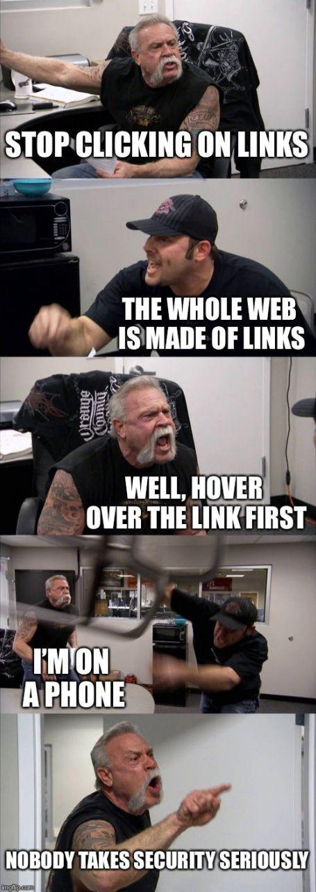

% O elo mais fraco da nossa segurança: S&nh5s
% Caio Volpato (caioau) \
  [caioau.keybase.pub](https://caioau.keybase.pub/) → [caioauheyuuiavlc.onion](http://caioauheyuuiavlc.onion/) \
    210B C5A4 14FD 9274 6B6A  250E **EFF5 B2E1 80F2 94CE** \
    Todos os copylefts são lindos, licenciado sob: [CC BY-SA 4.0](https://creativecommons.org/licenses/by-sa/4.0/)
% [CryptoGoma](https://encripta.org/) 

---
title: 'O elo mais fraco da nossa segurança: S&nh5s'
subtitle: 'Entenda o que são, como criar e gerenciar senhas fortes'
date: Cryptorave 2019
author:
- Caio Volpato (caioau) ([\@caioauv](https://twitter.com/caioauv)) [caioau.keybase.pub](https://caioau.keybase.pub/)
linkcolor: blue
urlcolor: blue
theme:
- Darmstadt
...


## Resumo:


* Que fatores de fato torna uma senha segura?
* Boas Praticas e dicas de senhas e segurança.
* Demonstração: Colocando tudo em pratica.
* **QUEM TEM COOKIE TEM MEDO**

<!---

This slide is generated using pandoc with beamer, to generate the slides pdf run:

pandoc -t beamer input.md -o output.pdf

if you dont have pandoc: 

sudo apt install pandoc texlive-latex-recommended

read pandoc manual:

https://pandoc.org/MANUAL.html#producing-slide-shows-with-pandoc

-->

---

### Casa hacker hackerspace

A Casa Hacker é um espaço hacker sem fins lucrativos e 100% dedicada a colocar comunidades locais no controle de suas experiências digitais e a moldarem o futuro da tecnologia da informação e comunicação para o bem público. Nós colocamos nossos princípios acima dos lucros e acreditamos que as tecnologias da nossa era são recursos públicos a serem explorados e construídos por todos, não uma mercadoria a ser vendida. Em um coletivo experiente, multidisciplinar e líder em tecnologia e sociedade desenvolvemos iniciativas de impacto social que empodera pessoas e transforma comunidades.

* Localizado em Campinas (campo grande).
* Website: [casahacker.org](https://casahacker.org)
* Redes sociais: @casahacker
* Mastodon: [\@casahacker@masto.donte.com.br](https://masto.donte.com.br/@casahacker)

---

## Glossário

### Engenharia Social:
Def: Engenharia social é a manipulação psicológica de pessoas para que realizem ações ou revelem informações.


---

Exemplo: Kevin Mitnick sempre pregou que a estupidez humana é a maior falha de qualquer sistema.


{ width=300px }


---


---

## Engenharia Social:

### Enganando a operadora:


Repare que o Mitnick "hackeou" a operadora sem nem usar um computador, só persuadindo as pessoas.

---

### (Logaritmo) Definição:

Chama-se logaritmo de b na base a, o expoente que se deve dar à base a de modo que a potencia obtida seja igual a b.

$\log_a  b = x \Leftrightarrow a^x = b$

---

## Propriedades dos logaritmos:

### Logaritmo da potencia:

$\log_a b^c = c \cdot \log_a b$

### Mudança de base:

$\log_a b = \dfrac{\log_c b}{\log_c a}$


---

## Escalas Logarítmicas: 

Quantidades que variam abruptamente:

* Pincode 4 dígitos = $10^4 =$ 10 mil combinações
* Senha 9 caracteres = $94^9 =$ 572994802228616704 (572 quadrilhão) 

Ou seja é difícil representar o numero de combinações. 


---

{ width=400px }

---

Senha de comprimento L e com N símbolos  → $N^L$ combinações. 

$H = \log_2(N^L) = L \cdot \log_2(N)$ 

cresce linearmente com conforme o tamanho da senha aumenta :)

Exemplos de escala logarítmicas: 

* Richter (terremotos).
* Decibel (som).
* Oitavas (musica).
* pH (química).


---

## Motivação:

Vazamento LinkedIn Jun2016: 61 milhões de senhas → 2h para quebrar 65% delas :O

{width=230px}

---

### Verifique por vazamentos: 

[haveibeenpwned.com](https://haveibeenpwned.com)


{width=300px}


---

## Análise de senhas:

Analise de um conjunto de dados com 10 milhões de senhas [link](https://xato.net/today-i-am-releasing-ten-million-passwords-b6278bbe7495#.6eti1aoge) 

Minha análise propõe estudar as seguintes características de interesse:

* As senhas mais comuns.
* Os tamanhos das senhas.
* Os grupos de caracteres (tipo: a senha tem apenas minúsculas e números).
* As “máscaras” das senhas.
    + (Estou chamando de máscara o “padrão” daquela senha, exemplo: a senha “abc123” tem a máscara “lllddd”, onde _l_ representa as minúsculas, _d_ os números, _u_ as maiúsculas e _s_ os caracteres especiais.)

---

## Resultados :

São 5,1 milhões (5.189.333) de senhas únicas, no total 9.997.922 senhas. 

Abaixo estão as 10 senhas mais frequentes,  correspondendo a 1.41%:

Senha       |    %freq
:---------- | -------------
123456      |     0.56%
password    |     0.20%
12345678    |     0.14%
qwerty      |     0.13%
123456789   |     0.12%
12345       |     0.11%
1234        |     0.06%
111111      |     0.06%
1234567     |     0.05%
dragon      |     0.04%

---

Abaixo os grupos:

Grupos   |  %
:------  | -------
l        | 38.25%
l+d      | 29.86%
d        | 20.36%
u+l+d    | 5.71%
u+l      | 2.52%
u+d      | 1.10%
u        | 1.09%
l+s      | 0.40%


---

Abaixo os 11 tamanhos mais frequentes:

tam      |  %
:--------|:---------
8        |  29.81%
6        |  25.45%
7        |  16.63%
9        |  6.81%
5        |  4.95%
10       |  4.71%
4        |  3.45%
11       |  2.64%
12       |  1.91%
13       |  1.36%
14       |  0.77%

---

Abaixo as 20 máscaras mais frequentes, correspondem a 65% do total:

máscara     |  %
----------  |  -------
llllll      |  11.76%
llllllll    |  8.98%
lllllll     |  7.50%
dddddddd    |  7.40%
dddddd      |  7.03%
lllll       |  3.15%
ddddddd     |  2.09%
lllllldd    |  2.00%
lllllllll   |  1.97%

---

### Lei de Zipf:


A lei diz a _k_-ésima palavra mais frequente vai aparecer proporcional a  _1/k_.


---

### Lei de Zipf

A lei de Zipf é um caso discreto da distribuição de Pareto, onde sua densidade vale:
$P(x) = \frac{ab^a}{x^{a+1}}$

onde o suporte é _x > b_ e _a > 1_;

Perceba que se aplicarmos log na distribuição teremos:
$\log(P(x)) = \log\left(\frac{ab^a}{x^{a+1}}\right) = \log(a) + a \log(b) -(a+1)\log(x)$

ou seja, o gráfico log-log da distribuição de Pareto é uma reta decrescente.

---

## Distribuição de Pareto

Dito isso, esse padrão não acontece apenas nas línguas, mas também descreve:

* População de cidades.
* O trafico de web-sites.
* A magnitude de terremotos.
* O número de citações em artigos acadêmicos.
* O diâmetro das crateras da lua.
* E [muito mais](http://arxiv.org/pdf/cond-mat/0412004.pdf).

---

### Princípio de Pareto:

Como tantos processos da vida real se comportam segundo a distribuição de Pareto, a partir da distribuição surge o Princípio de Pareto, que diz que via de regra aproximadamente 20% das causas são responsáveis por 80% dos resultados. 

Por exemplo:

* Na língua inglesa, 18% das palavras mais frequentes correspondem a 80% das ocorrências.
* Os 20% mais ricos correspondem a 82,7% de toda riqueza mundial.
* Nos EUA, 20% dos pacientes usam 80% dos recursos de saúde.


---

## Voltando para as senhas:

Lembrando que o gráfico log-log da distribuição de Pareto é uma reta descreste, assim temos os gráficos:

---


---


---


---

O Princípio de Pareto (aproximadamente 20% das causas são responsáveis por 80% dos resultados) também ocorre em:

* 20% dos grupos correspondem a 88% das senhas.
* 14% dos tamanhos correspondem a 88% das senhas

---

## Feynman: o abridor de cofres

{height=250px}

---

## Feynman: o abridor de cofres

Enquanto trabalhava no projeto Manhattan, ele queria mostrar que a guarda de documentos secretos era insegura.

Cofre: 100 marcações → segredo são 3 números → 1 milhão comb.

5s por tentativa → 60 dias para tentar todas as combinações

Faynman demorava 1.5 minuto :O


---

## Feynman: o abridor de cofres

### Como ele conseguiu esse feito?

* Tolerância mecânica de ± 2 , assim ele não precisava tentar as 100 combinações, mas apenas 20 ( 2 , 7 ,12 , 17 ... , 87, 92 , 97 ). Então agora tem apenas 8 mil demorando 10 horas.

* Muitas pessoas usavam uma data (DDMMAA) ou seja 30 , 12 e 45 combinações e considerando a tolerância mecânica isso dá 162 combinações ou seja 18 minutos.

* Muitos usavam como senha as constantes pi e _e_ ou seja 3.14159... → 31-41-59 , 2.71828... → 27-18-28.

---

## Feynman: o abridor de cofres

### Como ele conseguiu esse feito?

* Muitos não mudaram a senha padrão: 25-0-25 ou 50-25-50.

* Enquanto conversa com seus colegas e seu cofre estava aberto, girando o disco ele ouvia 2 clicks, descobrindo os 2 últimos números , assim ele tinha que testar 20 combinações, demorando 1.5 minutos.

---

## Feynman: o abridor de cofres

Em suma, Feynman tinha a reputação de abridor de cofres, pois:

* teve um pouco de "mente aberta" e perceber a tolerância mecânica.
* entender a natureza humana na escolha dos segredos.
* usava de eng. social para descobrir (grande parte) dos segredos.

---

{width=300px}

[watch a homemade robot crack a safe in just 15 minutes](https://www.wired.com/story/watch-robot-crack-safe/)

---

## Entropia de Shannon:

Intuitivamente pensamos que senha boa é uma senha toda complicada e difícil de lembrar.

por exemplo: **S&nh5F0d@** 

Ela tem: 

* 9 caracteres.
* maiúsculas.
* minúsculas. 
* números. 
* caracteres especiais. 

então ela deve ser boa. Porém, conforme veremos logo mais, **essa senha é quebrada em segundos.**

---

### Uma definição de aleatoriedade

Um evento é chamado aleatório de Kolmogorov se o menor programa de computador que produz aquele evento é maior ou igual que a descrição do evento em si.


---

Pense em um número entre 1 e 20. 

{width=280px}

Pesquisa com n=347

Você pensou em 17, 7 ou 13? Normalmente primos são favorecidos.

---

Outro exemplo é a falácia do apostador: um apostador deve apostar se uma bolinha vai cair no preto ou vermelho. 

Depois dela ter caído, por exemplo, 4 vezes seguidas no vermelho, o apostador pensa que é mais “provável” que agora ela “deve” cair na preta.

Porém, a bolinha tem 50%-50% de cair no preto e vermelho, **INDEPENDENTEMENTE DO RESULTADOS ANTERIORES**.

---

Para fechar: Compare o lançamento de uma moeda 30 vezes com como você acha que ela vai cair.


{width=200px}


A distinção aparecera ao contar sequencias de lançamentos, uma moeda verdadeiramente aleatória vai ser igualmente provável de conter qualquer sequencia de qualquer comprimento. (estabilidade de frequência). 


---

Mais exemplos:

* Problema de Monty Hall.
* Paradoxo do aniversario.

Ou seja: as pessoas têm uma intuição deturpada de um resultado aleatório. Esse comportamento de manada acaba produzindo senhas mais previsíveis.

---

## Oraculo de teclado


Oraculo de teclado: Quer testar o quão previsível você é? entre nesse [link](http://people.ischool.berkeley.edu/~nick/aaronson-oracle/index.html) e vá digitando d e f e a pagina vai mostrar com que precisão ele conseguiu prever.

---

Então, como avaliar se uma senha é de fato boa? Precisamos introduzir um conceito da teoria da informação, que é o conceito de entropia de Shannon: a entropia é a “media” de informação que aquela senha contém.

A entropia _H_, medida em bits, de uma senha com comprimento _L_, utilizando _N_ símbolos é definida como log na base 2 de todas as combinações que a senha pode ter, ou seja:

$H= \log_2(N^L) = L \cdot \log_2(N)$

---

Agora que sabemos como calcular a entropia, podemos calcular a tabela abaixo:

Grupo    |  Num símbolos (N)  |   entropia/simbolo (H)
:--------|:------------------:|:-----------------------:
números  |         10         |           3.32
letras   |         26         |           4.7
base64   |         64         |           6
“tudo”¹  |         94         |           6.5
palavra² |         7776       |           12.92

¹: tudo = maiúsculas (26) + minúsculas (26) + números (10) + caracteres especiais (32) = 94 símbolos.


---

creditos : [xkcd](https://www.xkcd.com/936/), tradução: [Oficina AntiVigilancia](https://antivigilancia.org/pt/2015/06/abre-te-sesamo-as-senhas-da-nossa-vida-digital-2/) 

{width=300px}

---

Agora fica a pergunta: quanta entropia minha senha deve ter?

No documentário [Citizenfour](http://www.imdb.com/title/tt4044364/) o Snowden fala:

> Assume your adversary is capable of one trillion guesses per second.

Assim, vamos presumir 1 trilhão de tentativas por segundos.

O tempo para quebrar uma senha (_T_) é o número de combinações que aquela senha pode ter, dividido pelo número de tentativas por segundo (_P_).

ou seja: _T = 2^(entropia) / P_.

Portanto, vamos calcular a tabela abaixo (considerando _P = 1_ trilhão/s) e o tamanho necessário da senha:

---

Entropia  |  Tempo para quebrar  |   base64  |   “tudo” |   N. de palavras
----------|:--------------------:|:---------:|:--------:|:----------------:
40        |  1.1 segundo         |   7       |   7      |   3
50        |  19 minutos          |   9       |   8      |   4
60        |  13 dias             |   10      |   10     |   5
65        |  1.1 anos            |   11      |   10     |   6
70        |  37 anos             |   12      |   11     |   6
80        |  38 milênios         |   14      |   13     |   6
100       |  40 bilhões de anos  |   17      |   16     |   8

(Observação importante: esse tempo é o tempo **GARANTIDO** de quebrar a senha. Ou seja, é o tempo que demora para percorrer TODAS as possibilidades. O tempo real para quebrar a senha pode ser menor)

---

Quero saber se minha senha é boa: você pode olhar a primeira tabela e calcular manualmente a entropia dela, mas sugiro que use [esse medidor de senha chamado Rumkin](http://rumkin.com/tools/password/passchk.php) ou [a lib `zxcvbn`](https://github.com/dropbox/zxcvbn) que [você pode usar aqui](https://dl.dropboxusercontent.com/u/209/zxcvbn/test/index.html).

(Observação: esses dois medidores de senhas avaliam sua senha localmente no seu navegador, nunca enviando a senha para a internet. Você pode digitar sua senha neles sem medo.)

Voltando pro exemplo do começo: a senha **S&nh5F0d@** é baseada em 2 palavras comuns e somente feita algumas substituições comuns e etc…

Segundo o Rumkin, **ela tem 40,7 bits de entropia**, que segundo a nossa tabela **é quebrada em questão de segundos** (o `zxcvbn` também mostrou isso).

---

## Método Diceware :

Preciso criar uma senha que seja fácil de lembrar e que tenha bastante entropia. Aí entra o método diceware (em português dadoware)

Diceware é um método no qual, através de um dado, uma lista de palavras, papel e lápis podemos construir senhas mais seguras.

Consulte o [livreto](https://github.com/thoughtworks/dadoware) da ThoughtWorks para pegar a lista de palavras.

O método consiste em usar o dado para sortear palavras da lista. Jogue o dado 5 vezes por palavra. Os dois primeiros números são as paginas do livreto e os três últimos, a palavra.

---

## Método Diceware :

### Método Completo:

1. Baixe o livreto com a lista de palavras: livreto
2. Tenha certeza que você esteja sozinho no quarto e feche a porta e janelas e escreva em cima de superfície dura.
3. Jogue o dado 5 vezes por palavra, exemplo: 2-6-5-1-3 : vá na pagina 2,6 do livreto e procure a palavra 513 = egípcio.
4. repita o 3o passo 6 vezes.
5. Jogue 1~3 para sortear a palavra vai ficar em maiúscula.
6. Jogue o dado 2 vezes por simbolo/numero.
7. faça o 6o passo 3~7 vezes.
8. Escreva a senha final algumas vezes, e digite-a para ajudar na memorização.
9. Depois de memorizar a senha, bote jogo no papel e jogue as cinzas no vazo sanitário.


---

## Método Diceware :

### Exemplos de senhas geradas:

1. Simples: 6 palavras **diceware**

> conhecer origem estrago maldade farra copa

Entropia=77 bits (1T/s = 2.4 mil anos,100T/s=24 anos)

2. Reduzida: 4 palavras da **wordlist completa (270 mil palavras)**

> recupereis flagelo passagens ancestralidade

Entropia=72 bits (1T/s = 150 anos, **100T/s = 1,5 anos**)

**Atenção: Esse tempo é o pior caso: o tempo de percorrer todas as combinações, o tempo real será menor (na media metade)** 

---

## Método Diceware :

Dito isso, [fiz esse código em Python](https://github.com/caioau/personal/blob/master/DicewareGen/dicewareGen.py) para gerar uma senha (ele também gera números e caracteres especiais), a principal função dele é:


```python
from random import SystemRandom as cryptogen
def GenDiceware(filename, n=6):
    with open(filename) as f:
        words = [line.strip() for line in f]
    return [cryptogen().choice(words) for _ in range(n)]
```

Observação 1: além da [lista de palavras do livreto](https://github.com/thoughtworks/dadoware/blob/master/7776palavras.txt), tem uma wordlist completa [link](https://github.com/caioau/personal/blob/master/DicewareGen/brazilian.utf8) (270 mil palavras = 18 bits de entropia / palavra).

Observação 2: Atente-se o uso da classe SystemRandom, que utiliza um gerador de número pseudoaleatório **CRIPTOGRAFICAMENTE SEGURO (CPRNG)** (em python3: use a lib nativa secrets)

---

## Método Diceware :

Em suma, o diceware é um método de gerar senhas que é:

* Harder: as senhas geradas são verdadeiramente aleatórias as tornando bem mais difíceis de quebrar.
* Better: são melhores para lembrar.
* Faster: é mais rápido de pensar numa senha, basta jogar o dado (ou fazer no computador).
* Stronger: As senhas geradas são fortes, pois tem mais entropia.

---

## Gerenciador de senhas (Password Manager)

Agora que sabemos como avaliar se uma senha é boa e como gerar boas senhas, ainda precisamos resolver o seguinte problema: precisamos ter uma senha para cada serviço.

Uma solução para isso é um password manager (gerenciador de senhas), é um programa que cria boas senhas aleatórias automaticamente, para cada site individualmente, guardando todas essas senhas trancadas com apenas uma senha mestra.

**KeePass/KeePassXC** é minha recomendação padrão, ele é software livre, está disponível nas principais distros GNU/Linux e existe pra Android: keepassdx (na F-Droid) e tem auto-type.

---

## Gerenciador de senhas 

{width=300px}

---

## Gerenciador de senhas 

{width=130px}


---

## Gerenciador de senhas 

O uso dele é: você cria seu banco de senhas (.kdbx), cadastra as entradas de seus serviços e, então, o programa gera uma senha aleatória, como por exemplo: 

> m3rVra(x{p4}zRtp,$FKm-WWJf)w&J

Quando você precisar acessar um serviço, você abre o arquivo, ele vai pedir sua senha mestra e então selecione a entrada que você precisa.

### Dica: tempo de expiração

Quando estiver criando uma entrada selecione para ele marcar como expirada daqui por exemplo 3 meses te lembrando de trocá-la

---

## Gerenciador de senhas 

### Como acessar as entradas:

* Área de transferência: Pressionando control-C com a entrada desejada selecionada e control-V no campo de senha.
    + **Nunca** utilize a área de transferência no Android, pois ela é compartilhada
* Auto-Type: configure o atalho e ele vai digitar login e senha sozinho.

---

## Gerenciador de senhas 

### Ultimo passo

Va em **Database** → **Database settings** → **Security** → Escolha **argon2** e coloque benchmark 1s delay e multiplique esse numero por 3~10

{width=350px}

---

## Gerenciador de senhas

### Como sincronizar minhas senhas com meu celular?

{width=180px}

Recomendo o software livre [Syncthing](https://syncthing.net/) é um app pra android e um programa pra pc, no qual ele sincroniza pastas entre seus dispositivos, criando assim sua nuvem pessoal e descentralizada. 

---

## Autenticação em duas etapas (2FA)

A ideia por trás da autenticação em duas etapas (2FA -- 2 factor authentication) é que para entrar na sua conta além da senha (que uma coisa que só você sabe), precisa de uma coisa que só você tem, no caso um app no celular.

Como usar: cada serviço é diferente, veja em [turnon2fa.com](https://www.turnon2fa.com/) como habilitar no serviço especifico. Normalmente, você escaneia um QR code com um app. Recomendo o [andOTP](https://f-droid.org/packages/org.shadowice.flocke.andotp/) (é software livre, tem na F-Droid ).

Quando você for entrar na sua conta, após colocar a senha, deverá colocar um número gerado pelo app. Cada número só dura 30s, então não tem problema se alguém ver o código num determinado momento, conforme mostrado na figura:

---

## Autenticação em duas etapas (2FA)
{width=150px}

---

## Autenticação em duas etapas (2FA)

Caso você não esteja convencido que precisa disso: veja essa reportagem que foi capa da _Wired_ em Dez2012: [Kill the Password: A String of Characters Won't Protect You](https://www.wired.com/2012/11/ff-mat-honan-password-hacker/).

{width=150px}

---

## Autenticação em duas etapas (2FA)

Resumidamente: por meio de engenharia social, descobriram algumas informações pessoais dele, ligaram no suporte da Apple, falando que ele tinha esquecido a senha dele e com as informações dele conseguiram responder as perguntas de segurança. Assim, pegaram a senha do iCloud dele, entraram no Find My mac e mandaram deletar remotamente os dispositivos dele.

Ou seja, muito embora o Mat Honan usasse senhas robustas, conseguiram “pegar tudo” dele.

---

## Autenticação em duas etapas (2FA)

### Autenticação em duas etapas com SMS:

Usar SMS para autenticação eh péssimo, pois:

1. Pode comprometer sua privacidade ([como o facebook fez](https://techcrunch.com/2018/09/27/yes-facebook-is-using-your-2fa-phone-number-to-target-you-with-ads/))
2. Pode ser interceptado por torres espias.
3. Seu SIM card pode ser "clonado" (SIM swapping) 
    * Dez2018:[Golpe com número clonado usa WhatsApp](https://www.techtudo.com.br/noticias/2018/12/golpe-com-numero-clonado-usa-whatsapp-e-atinge-mais-de-5-mil-vitimas.ghtml)
    * **habilite a verificação em dois passos em seus mensageiros**

### Notificações sensíveis:

Outro problema e que a mensagem pode aparecer na tela de bloqueio, conforme a figura

---

## Notificações sensíveis:

{width=150px}

---

## Notificações sensíveis:

Você pode resolver isso: 

* Android: vá em Configurações → Preferencia da tela de bloqueio → selecionar ocultar conteúdo confidencial 
* Iphone: Ajustes → Notificações → Pré-Visualizações → selecionar nunca

---

## Notificações sensíveis:

{width=150px}

---

## Tokens de segurança (yubikey)

### 2FA é susceptível a ataques phishing

Mesmo que usar 2FA seja um método robusto para proteger suas contas, mas infelizmente é susceptível a ataques phishing (no qual o atacante cria um pagina de login idêntica do serviço original e redireciona a vítima e a faz entrar suas credenciais e o código 2FA, dando acesso ao atacante a conta da vítima).

### Tokens de segurança:

Os tokens de segurança são uma maneira mais segura de autenticação em duas etapas, utilizam o padrão Universal 2nd Factor -- U2F que usa criptografia de chave pública e privada para assinar um desafio enviado pelo serviço e como o domínio é enviado para o token dessa forma a pagina falsa não consegue acessar a chave do serviço legitimo. Toda vez que o token é utilizado é necessário tocar fisicamente ele.

---

## PinCodes: 

[PIN analysis](http://www.datagenetics.com/blog/september32012/)

{width=220px}

---

Em excelente seu post ([PIN analysis](http://www.datagenetics.com/blog/september32012/)), Nick Berry analisou 3.4 milhões de PinCodes de 4 dígitos (10 mil combinações). E constatou:

* Os top 20 pincodes são responsáveis por 27% do total.
* Estatisticamente 1/3 de todos os PinCodes podem ser adivinhados apenas testando 61 combinações.
    + 50% pode ser adivinhado testando apenas 426 combinações (muito menos que 5000).
* PinCodes contendo Anos (19XX) e datas (MMDD) são muito frequentes.

---

## Padrão de desbloqueio do Android

Se você usa o padrão do Android (aquela gradezinha 3x3): existem 389112 possibilidades que podem ser usadas (ou seja **usar um PinCode verdadeiramente aleatório de 6 dígitos é um pouco melhor** ).

Uma pesquisadora norueguesa chamada Marte Løge em sua tese de mestrado mostrou que mais de 10% dos padrões analisados, usa como padrão de desbloqueio uma "letra" que é a inicial do companheiro, filho, ou algo parecido.

veja o artigo na arstechnica falando sobre o assunto: [New data uncovers the surprising predictability of Android lock patterns](https://arstechnica.com/security/2015/08/new-data-uncovers-the-surprising-predictability-of-android-lock-patterns/)

---

## Ataques de canal lateral

### Definição: Ataques de canal lateral

Ataques da canal lateral são aqueles que se concentram na forma que o sistema eh implementado, se ela vaza alguma info sensivel que pode ser monitorada pelo atacante. 

* exemplo: analise de potencia usada para vazar a chave privada de um smartcard

{width=200px}


---

## Ataques de canal lateral

### Uso do acelerômetro para descobrir o pincode

Nesse paper: [Stealing PINs via Mobile Sensors: Actual Risk versus User Perception](https://arxiv.org/pdf/1605.05549v1.pdf) os pesquisadores conseguiram descobrir 80% dos pincodes digitados no celular através de um script js no navegador que monitora o movimento através do acelerômetro.


---

## Ataques de canal lateral

### Câmera térmica

Nesse video : [iPhone ATM PIN code hack- HOW TO PREVENT](https://youtu.be/8Vc-69M-UWk) ele mostra um "case" para iPhone que é uma câmera térmica e através do calor dos dedos é possível descobrir o pincode digitado, conforme a foto abaixo:

---

## Ataques de canal lateral

{height=200px}


note que as teclas que estão com uma coloração mais clara estão mais quentes, ou seja foram digitadas por ultimo: ou seja o pincode digitado foi 12345.

---

## Ataques de canal lateral

para prevenir desse ataque ele sugere que enquanto digita o pincode mantenha os dedos sobre todas as outras teclas, assim todas as teclas ficaram com uma coloração mais clara. 

resultado:

{height=200px}

---

## Boas Praticas de Segurança:


{height=280px}


---

## Boas Praticas de Segurança:

### Boas Praticas de Segurança: Computador:

* mantenha seu sistema e programas atualizados.
* não use flash (caso você precise utilize extensões como flash control que só habilita o flash nesses sites).
* faça backups.
    + Backup não é uma copia simples, ou seja o backup deve ser feito em outra mídia.
    + deve ser automático e periódico, porém não confie cegamente no automático: certifique-se que está sendo feito.
* baixe apenas programas confiáveis de fontes confiáveis (tente ao máximo só utilizar os repos oficiais de sua distro).

---

### proteja seu wifi:
* use uma senha forte. 
    + dica: como passar sua senha forte: visite [qrstuff.com](https://www.qrstuff.com/) selecione a opção Wifi Login e gere seu qr code e use o app [Barcode Scanner](https://f-droid.org/packages/com.google.zxing.client.android/) para escanear o qr e salvar a rede no android.
* troque a senha padrão da administração e desabilite o acesso remoto.
* desabilite o UPnP e o WPS.
* mantenha o firmware do seu roteador atualizado (e se possível procure alternativas livres como librewrt)

---

### Dicas especificas pro Windows:

* crie apenas um usuário administrador e use apenas os usuários sem privilégios de administrador.
* use um antivírus e o mantenha atualizado. 
* use uma conta local (não utilize sua conta microsoft).
* use e rode com frequência o CCleaner ou Advanced SystemCare.
* desinstale programas desnecessários. 

Windows 10: Desativar envio de seus dados: [W10 privacy](https://www.winprivacy.de/english-home/)

---

### Boas Praticas de Segurança: Android:
* [The Privacy Enthusiast's Guide to Using Android](http://lifehacker.com/the-privacy-enthusiasts-guide-to-using-android-1792432725): 
    + Use PinCode ou senha Forte (6+ dígitos **VERDADEIRAMENTE ALEATÓRIOS**).
    + tenha consciência que se você usa a digital para desbloquear seu aparelho podem te forçar você a colocar seu dedo.
    + "Esconda" notificações sensíveis da tela de bloqueio.
    + Desative "minhas atividades" do Google (histórico de buscas, localização, etc ...): [myactivity.google.com/myactivity](https://myactivity.google.com/myactivity)
    + Desative (ou não) o find my phone
    + Desative Backup do Google: histórico de chamadas, senhas do Wifi e Apps são salvos no Google.
    
--- 

### Boas Praticas de Segurança: Android:  

* Desative permissões desnecessárias.
* Vá no app de Câmera e desabilite a opção de Geolocalização.
* Use o app chamado Send Reduced que além de tirar metadados de fotos, reduz seu tamanho, [fdroid](https://f-droid.org/repository/browse/?fdfilter=size&fdid=mobi.omegacentauri.SendReduced)

### Isole Apps sensíveis:

Recomendo o shelter (fdroid): ele cria um perfil isolado e permite usar apps de maneira isolada e permite "congelar" apps preservando sua privacidade.

### Bloqueie uso indevido do seu microfone:

Recomendo o app PilferShush Jammer (fdroid): ele bloqueia apps de usarem seu microfone. 

---

### Leituras Complementares:

Além dessas dicas de segurança vou indicar algumas leituras complementares:

* [Cartilhas de segurança para internet - CERT.br](https://cartilha.cert.br/).
* [The Motherboard Guide to Not Getting Hacked](https://motherboard.vice.com/en_us/article/d3devm/motherboard-guide-to-not-getting-hacked-online-safety-guide) [pt-br](https://motherboard.vice.com/pt_br/article/9aqe47/guia-motherboard-para-nao-ser-hackeado)
* [The WIRED Guide to Digital Security](https://www.wired.com/2017/12/digital-security-guide/)
* [Device Privacy Tips - DuckDuckGo](https://spreadprivacy.com/tag/device-privacy-tips/)

---

## Resumo

* Nossas senhas são ruins.
* O que de fato torna uma senha segura?
    + entropia → comprimento=14+ chars ou 6+ palavras 
    + verdadeiramente aleatória → dado ou **CPRNG**
* Gerenciar senhas distintas por serviço? → Password Manager 
    + e como sincronizá-lo de maneira segura → Syncthing
* Proteger sua conta para que mais ninguém a acesse? → 2FA
* Boas praticas de segurança para seus dispositivos.

---

## Demonstração: Colocando tudo em pratica:

* Gerando uma senha mestra com diceware.
* Criando o arquivo do KeePassXC
* Instalando e configurando o syncthing para syncar o Android.
* Usando KeePassDX e andOTP no android.


---

{height=300px}
