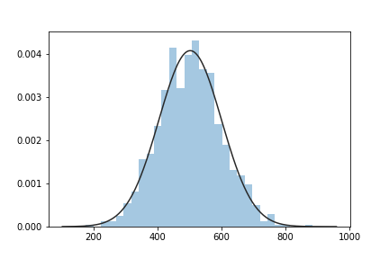
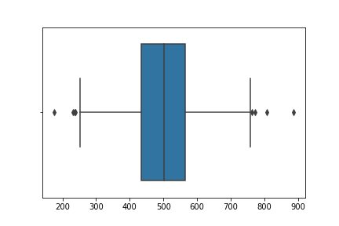

% Introduction to statistics
% Caio Volpato (caioau) \
  [caioau.keybase.pub](https://caioau.keybase.pub/) → [caioauheyuuiavlc.onion](http://caioauheyuuiavlc.onion/) \
    210B C5A4 14FD 9274 6B6A  250E **EFF5 B2E1 80F2 94CE** \
    All Copylefts are beautiful: licensed under [CC BY-SA 4.0](https://creativecommons.org/licenses/by-sa/4.0/)

---
title: 'Introduction to statistics'
subtitle: 'Learning the basics of probability and statistics'
date: 
author:
- Caio Volpato (caioau) [caioau.keybase.pub](https://caioau.keybase.pub/)
linkcolor: blue
urlcolor: blue
theme:
- Darmstadt
colortheme:
- rose
...

## Summary:

* Probability concepts
* Discrete distributions.
* Continuous distributions.
* Calculations on the Normal distribution.
* Convergence
* Inference

<!---

This slide is generated using pandoc with beamer, to generate the slides pdf run:

pandoc -t beamer input.md -o output.pdf

if you dont have pandoc: 

sudo apt install pandoc texlive-latex-recommended

read pandoc manual:

https://pandoc.org/MANUAL.html#producing-slide-shows-with-pandoc

-->

--- 

### Motivation

{height=200px}


---

## Basic concepts of probability:

### Sample space $\Omega$

It's the set of all the possible outcomes of a experiment, denoted by S or $\Omega$

### Event

It's a subset of the sample space.

---

## Basic concepts of probability:

### Probability (Definition):

Given a experiment with a sample space $\Omega$ and a class of events $\mathcal{A}$, the probability denoted by $\mathbb{P}$ is a function which has $\mathcal{A}$ as domain and associate a numerical value between $[0, 1]$ as image.

### Probability properties:

1. $\mathbb{P} (\Omega) = 1$ and $\mathbb{P} (\emptyset) = 0$
2. $0 \leq \mathbb{P}(A) \leq 1$, for every event A
3. For any sequence of mutually exclusive events $A_1, A_2, \ldots$ that's events that $A_i \displaystyle\bigcap A_j$ when $i \neq j$ we have that:

$$\mathbb{P} \left(\displaystyle\bigcup_{i=1}^\infty A_i \right) = \sum_{i=1}^\infty \mathbb{P}(A_i)$$


---

## Basic concepts of probability:

### Event independence:

Two events are independent when the occurrence of the first does not affect the probability of ocurrence of the second.

Two events A and B are independent if:

$$\mathbb{P} (A \bigcap B) = \mathbb{P}(A) \mathbb{P}(B)$$

### Conditional Events:

The probability of a event A to occur given that the event B occurred is: 

$$ \mathbb{P} (A|B) = \frac{\mathbb{P}(A \bigcap B)}{\mathbb{P}(B)}$$

---

## Basic concepts of probability:

### Bayes theorem:

$$ \mathbb{P} (A | B) = \frac{\mathbb{P}(B | A) \mathbb{P}(A)}{\mathbb{P}(B)}$$

General case:

$$ \mathbb{P}(A_i | B) = \frac{\mathbb{P}(B | A_i) \mathbb{P} (A_i)}{\sum_{j=1}^n \mathbb{P}(B | A_j) \mathbb{P} (A_j)}$$

---

### Bayes example (from [Veritasium](https://www.youtube.com/watch?v=R13BD8qKeTg)):

You are felling sick, so you go to the doctor, there you run a battery of tests. After getting the results you tested positive for a rare disease (affects 0.1% of the population), the test will correctly identify that you have it 99% of the times. 

What's the chances that you actually have the disease? 99%?

---

### Bayes example Solution

Let's denote the event of you have the disease H (stands for hypothesis, the prior) and the test been positive denoted by E (stands for evidence), so we have: $\mathbb{P}(H) = 0.001$ and  $\mathbb{P}(E|H) = 0.99$

$$\mathbb{P} (H | E) = \dfrac{\mathbb{P}(E|H) \mathbb{P}(H)}{\mathbb{P}(E)} = \dfrac{\mathbb{P}(E|H) \mathbb{P}(H)}{\mathbb{P}(H)\mathbb{P}(E|H) + \mathbb{P}(H^C)\mathbb{P}(E|H^C)} = $$

$$=\frac{0.99 \cdot 0.001}{0.001 \cdot 0.99 + 0.999 \cdot 0.01} = 0.09 = 9\%$$

What if you test again and it's also positive? You can just take the posterior probability we just calculated and use as a prior:

$$=\frac{0.99 \cdot 0.09}{0.09 \cdot 0.99 + 0.91 \cdot 0.01} = 0.907 \approx 91\%$$

* Awesome video: [A visual guide to Bayesian thinking](https://www.youtube.com/watch?v=BrK7X_XlGB8)

---

](statML.jpeg){height=250px}

---

### Random Variable (RV)

Consider a experiment with a sample space $\Omega$ associated with it. A function that maps each element $\omega \in \Omega$ to a Real number such that $[w \leq X]$ it's called random variable (RV) ($X: \Omega \rightarrow \mathbb{R}$)

* Example: Imagine a experiment that consist of 3 consecutive fair coin tosses, so the sample space of this experiment is: \
S = {(H,H,H), (H,H,T) , ... (T,T,T)} . Now we want to create a random variable X that counts the number of heads in each outcome, so X((H,H,H)) = 3 and X((H,H,T)) = 2. 


---

## Random Variable:

### Probability Mass Function (PMF):

$$ f_X(x) = \mathbb{P} [X = x] = \mathbb{P}[\{\omega \in \Omega : X (\omega) = x\}]$$

### Probability Density Function (PDF)

$$ \mathbb{P} [a \leq X \leq b] = \int_a^b f(x) dx$$

### Cumulative Distribution Function (CDF)

$$ F_X (x) = \mathbb{P} [X \leq x]$$

---

### Expectation:

* Discrete : $\mathbb{E} [X] = \displaystyle\sum x \mathbb{P}(X=x)$
* Continuous: $\mathbb{E} [X] = \displaystyle\int_{-\infty}^\infty x f(x) dx$

### Variance: 

$$ \mathbb{V}[X] = \sigma_X^2 = \mathbb{E}[X^2] - \mathbb{E}^2[X]$$

### Sample mean:

$$ \overline{X_n} = \dfrac{1}{n} \displaystyle\sum_{i=1}^n X_i $$

### Sample variance and standard deviation: 

$$ s^2 = \dfrac{1}{n-1} \displaystyle\sum_{i=1}^n (X_i - \overline{X})^2$$

Standard deviation = s 

---

## Discrete distributions

### Bernoulli:

Consider a experiment with has two possible outcomes: success (X=1, with probability p) or failure (X=0), this random variable is called Bernoulli, the PMF is:

$$ \mathbb{P}(X = k) = p^k (1-p)^{1-k}$$

### Binomial:

Now consider a Bernoulli experiment conducted n times, let X be the random variable that represents the number of successes, X is called Binomial, the PMF is:

$$\mathbb{P}(X = k) = \binom{n}{k} p^k (1-p)^{n-k}$$


---

## Discrete distributions

### Geometric:

Again consider a Bernoulli experiment conducted n times, but the first n-1 are failures and the last nth is a success. Let X be number of tries , which is called Geometric, the PMF is:

$$ \mathbb{P} (X = k) = (1-p)^kp$$

* A important property is that Geometric distribution is the only discrete distribution that is **memoryless**.

### Poisson:

A random variable which value can assume 0,1,2 ... is called Poisson with $\lambda > 0$ parameter if your PMF is:

$$ \mathbb{P}(X = k) = \dfrac{e^{-\lambda}\lambda^k}{k!}$$

---

## Discrete distributions plots

### Geometric:

{height=250px}


---

## Discrete distributions plots

### Binomial:

{height=250px}

---

## Discrete distributions plots

### Poisson:

{height=250px}

---

## Continuous distributions

### Normal (or Gaussian, bell curve):

A continuous real random variable is called Normal with $\sigma^2 > 0$ (squared scale), $\mu \in \mathbb{R}$ (location) parameters if your PDF is:

$$ f(x) = \frac{1}{\sigma\sqrt{2\pi}} \exp\left(-\frac{1}{2}\left(\frac{x - \mu}{\sigma}\right)^2\right)$$

* The normal function is a example of Liouville's theorem, an probability cannot be analytically calculated, only be numeric methods.

* Fun facts: the half inside the exponential is for the variance to be 1, and the $\sqrt{2\pi}$ is for the integral in the whole support to become 1. 

---

## Continuous distributions

### Exponential

A continuous **positive** random variable is called Exponential with $\lambda > 0$ (rate or inverse scale) parameter if your PDF is:

$$ f(x) = \lambda e^{-\lambda x}$$

Important property: Exponential and Geometric (discrete) distribution are the only distributions that are **memoryless**.

#### Memoryless property:

$$ \mathbb{P}[X > x + y \; | \; X > y] = \mathbb{P}[X > x]$$

So no matter how much time has passed it's like the process is starting from beginning.

---

## Continuous distributions

### Pareto

A continuous $x \in [x_m, \infty)$ random variable is called pareto with $x_m >0$ (scale) and $\alpha > 0$ (shape) parameters if your PDF is:

$$ f(x) = \frac{\alpha x_m^\alpha}{x^{\alpha + 1}}$$

Zipf is the discrete distribution of pareto

Pareto is a **heavy tailed** distribution: It means it goes to zero slower (than exponential).

#### Pareto principle (80-20 law):

The pareto principle states that 80% of results is caused by 20% of the effects, for example wealth distribution, software bugs etc ...

It's a particular pareto distributed values when $\alpha  \approx  1.161$

---

## Continuous distributions plots

### Normal:

{height=250px}

---

## Continuous distributions plots

### Exponential:

{height=250px}

---

## Continuous distributions plots

### Pareto:

{height=250px}

---

### Calculations on the Normal distribution

Given a Normal distributed values, how to calculate the probability on it?

With normal distribution we usually use a standard normal (where $\mu = 0, \sigma = 1$) cumulative table and standardize the values. 

* How to standardize the values: Given $X \sim N(\mu, \sigma^2)$

$$ z = \frac{x - \mu}{\sigma} \quad \text{or} \quad z = \frac{x - \overline{x}}{s}$$

z is called **z score** and is **standard normal** distributed.

* Standard cumulative $\Phi(x)$:

$\Phi(x) = \mathbb{P}(z \leq x)$ also $\Phi(-x) = 1 - \Phi(x)$


$\Phi(x)$ values can we found in a [table](https://en.wikipedia.org/wiki/Standard_normal_table#Cumulative) or using NORMSDIST function in Excel or in Python using stats.norm.cdf function from SciPy.

---

### 68-95-99.7 rule:

The 68-95-99.7 rule also know as the empirical rule is a shorthand to remember the percentage of Normal distributed values that lie within arround the mean with a width of 1,2,3 standard deviations.

$$ \mathbb{P}( \mu - 1\sigma \leq X \leq \mu + 1\sigma) \approx 0.6827$$
$$ \mathbb{P}( \mu - 2\sigma \leq X \leq \mu + 2\sigma) \approx 0.9545$$
$$ \mathbb{P}( \mu - 3\sigma \leq X \leq \mu + 3\sigma) \approx 0.9973$$

We don't have to memorize this values, we can calculate it:

$$ \mathbb{P}( \mu - 1\sigma \leq X \leq \mu + 1\sigma) = \mathbb{P}(-1\sigma \leq X - \mu \leq 1\sigma) = $$

$$ \mathbb{P}\left(-1 \leq \frac{X - \mu}{\sigma} \leq 1\right) = \mathbb{P}(-1 \leq z \leq 1) = \Phi(1) - \Phi(-1) \approx  0.6827 $$

---

### 68-95-99.7 rule: Chart

](553px-Empirical_rule_histogram.svg.png){height=250px}

---

### Calculations on the Normal distribution: Example from Ross:

X is a normal random variable with parameters: $\mu = 3$ and $\sigma^2 = 9$, Calculate: (a) $\mathbb{P}(2 < X < 5)$ (b) $\mathbb{P}(X > 0)$ (c) $\mathbb{P}(|X - 3| > 6)$


{height=200px}

---

### Calculations on the Normal distribution: Example from Ross: part a

{height=150px}

$$ \mathbb{P}(2 < X < 5) = \mathbb{P}\left(\frac{2-\mu}{\sigma} < \frac{X - \mu}{\sigma} < \frac{5 - \mu}{\sigma}\right) = \mathbb{P}\left(\frac{-1}{3} < Z < \frac{2}{3}\right) = $$

$$ \Phi\left(\frac{2}{3}\right) - \Phi\left(\frac{-1}{3}\right) =  \Phi\left(\frac{2}{3}\right) - \left[1 - \Phi\left(\frac{1}{3}\right)\right] \approx 0.3779$$

---

### Calculations on the Normal distribution: Example from Ross: part b

{height=150px}

$$ \mathbb{P}(X > 0) = \mathbb{P}\left(\frac{X - \mu}{\sigma} > \frac{-\mu}{\sigma}\right) = \mathbb{P}(Z > -1) = 1 - \Phi(-1) = $$

$$ = \Phi(1) \approx 0.8413$$

---

### Calculations on the Normal distribution: Example from Ross: part c

{height=120px}

$$ \mathbb{P}(|X - 3| > 6) = \mathbb{P}(6 < X - 3 < -6) = \mathbb{P}(9 < X < -3 ) = $$


$$ \mathbb{P}(X > 9) + \mathbb{P}(X < -3) = \mathbb{P}\left(\frac{X-\mu}{\sigma} > \frac{9 - \mu}{\sigma}\right) + \mathbb{P}\left(\frac{X - \mu}{\sigma} < \frac{-3 - \mu}{\sigma}\right)$$

$$ = \mathbb{P}(Z > 2) + \mathbb{P}(Z < -2) = 2[1 - \Phi(2)] \approx 0.0456$$

---

### Assumptions on distribution choice

](memeNormal.jpg){height=250px}

---

### Assumptions on distribution choice

{height=280px}

---

### Assumptions on distribution choice

In order to know which distribution of your data values understanding the nature of the problem is fundamental. 

Is your values a result from counting? So is it discrete ? Or continuous? Which values are possible? 

#### Discrete distributions:

* Bernoulli: boolean result, example: coin toss, second turn (with only 2 candidates) election.

* Binomial: Number of "success" results given a permanent experiment runs. Example: From 20 devices after a long time what's the probability of 15 of them has a kind of defect. 

* Geometric: Number of failures until the first success. Example: The probability of winning the lottery is 1 in 1 million, What's the probability of winning it after 3 tries? 

* Poisson: Example: Number of cars on the road.

---

## Assumptions on distribution choice

### Continuous distributions:

* Normal: No restriction on possible values (positive and negative values are valid). Example: The height of children of the same sex and age.

* chi-squared: Only positive values, unlike normal is not symmetric. 

* Exponential: Only positive values, describes the time until failure. 

* Pareto: Only positive values and bigger and $x_m$. Example: Size of gold mines, very few big mines and a lot of small ones. 

---

### order statistics and quantiles

* Given $X_1,X_2, \cdots, X_n$ values from the same distribution, let:

$X_{(1)}$ the smallest value from $X_1,X_2, \cdots, X_n$ (minimum) 

$X_{(2)}$ 2th smallest value from $X_1,X_2, \cdots, X_n$ 

$X_{(j)}$ jth smallest value from $X_1,X_2, \cdots, X_n$ 

$X_{(n)}$ the **biggest** value from $X_1,X_2, \cdots, X_n$ (maximum)

* q-quantiles are values that partition the values into q subsets of (almost) equal sizes. For instance: q=2 we have the median, 4 the quartiles , 100 percentile and so on ...

* Why use quantiles? Why use median instead of the mean? Because Order statistics is a **robust statistic** which means it is not affected by outliers.

---

### boxplots:

](550px-Boxplot_vs_PDF.svg.png){height=250px}


---

### Boxplots example:

Let X_n be a sequence of normal distributed random variable with $\mu = 500$ and $\sigma = 100$ we have n=1000 samples, results:

{height=250px}

---

### Boxplots example:

{height=150px}


```
count    1000.000000
mean      501.933206
std        97.921594
min       175.873266
25%       435.240969
50%       502.530061
75%       564.794388
max       885.273149
```

---

### Convergence

In statistics there some types of convergence, the main ones are:

Let $\{X_1, X_2, \cdots \}$ be a sequence of identically distributed random variables.

1. In Probability: $X_n \overset{p}{\longrightarrow} Y$ :

$$ (\forall \varepsilon > 0) \quad \displaystyle\lim_{n \to \infty} \mathbb{P}(| X_n - Y | > \varepsilon ) = 0$$

2. In distribution (weakly, in law):  $X_n \overset{D}{\longrightarrow} Y$

$$ \displaystyle\lim_{n \to \infty} F_{X_n} (x) = F_Y (y) $$

3. Almost sure (strongly) : $X_n \overset{as}{\longrightarrow} Y$

$$ \mathbb{P} \left( \displaystyle\lim_{n \to \infty} X_n = Y\right) = 1 $$


---

## Convergence

### Law of large numbers (LLN):

Let $\{X_1, X_2, \cdots \}$ be a sequence of identically distributed random variables and $\mathbb{E}[X] = \mu$

#### Weak (WLLN)

$\overline{X_n} \overset{p}{\longrightarrow} \mu \quad n \rightarrow \infty$

#### Strong (SLLN)

$\overline{X_n} \overset{as}{\longrightarrow} \mu \quad n \rightarrow \infty$

In words: The sample mean converge to the (theoretical) expected value as the sample size increases. 

---

## Convergence

### Central Limit Theorem (CLT)

Let $\{X_1, X_2, \cdots \}$ be a sequence of identically distributed random variables and $\mathbb{E}[X] = \mu$ and $\mathbb{V}[X] = \sigma^2$

The CLT states that:

$$ \overline{X_n}  \overset{D}{\longrightarrow} \mathcal{N}\left(\mu, \dfrac{\sigma^2}{n}\right)$$

After some transformations we have:


$$ \frac{\sqrt{n}(\overline{X_n} - \mu)}{\sigma} \overset{D}{\longrightarrow} \mathcal{N}(0,1)$$

---

### Inference:

Inference is the process to deduce (estimate) the properties of underlying probability distribution from the data values.

#### Maximum likelihood estimator (MLE):

One of the most popular estimator method is the maximum likelihood estimator, it consists of finding the parameters that maximizes the likelihood function (via derivatives).

#### Q-Q plot:

Q-Q (quantile-quantile) plot: Is a plot where data quantiles are ploted in one axis and the theoretical quantiles of the fitted distribution on the other axis and a linear regression of the points. This plot can be used to provide a assessment of the "goodness of fit" and maybe find out the data outliers on the data. 

---

### Inference process

Given some data the inference process goes like this:

1. Choose a distribution (based on the nature of the problem).
2. Fit the distribution (estimate the parameters).
3. Create a q-q plot to judge the goodness of fit, if some outliers are found they can be identified (and maybe left out). 

If the line still not good try starting again with a different distribution.

---

### Inference example:

Using the same data from the boxplot example, the Q-Q plot: 

{height=150px}

The plot has created using [stats.probplot](https://docs.scipy.org/doc/scipy/reference/generated/scipy.stats.probplot.html) from SciPy.

Using stats.norm.fit we can estimate (fit) the parameters (assuming normal distribution), we get: loc=501.93 and scale=97.87 we generated random values using loc=500,scale=100n=1000 (the fit could get better with a bigger sample)

---

### Inference example 2:

With new data (n=1000), the Q-Q plot:

{height=200px}

Looking at the line we can clearly see that the line did not fit the points, the data probably is not normal distributed.

---

### Inference example 2: histogram:

{height=200px}

the values is not symmetric, one good guest is that it's a chi squared distribution.

---

### Inference example 2: Q-Q plot assuming chi squared:

{height=200px}

Using stats.chi2.fit we can estimate (fit) the parameters: df=5.5,loc=460,scale=74, we generated random values using df=4,loc=500,scale=100.

---

### Further reading:

To study those topics in depth, here are some awesome references:

#### Getting started: 

* Podcast: (pt) [Pizza de Dados](https://pizzadedados.com/)
* Book: The Lady Tasting Tea: (pt) Uma Senhora Toma Chá.
* [/r/dataisbeautiful](https://www.reddit.com/r/dataisbeautiful/)

#### Studying material:

* (pt) [Portal Action](http://www.portalaction.com.br/ambiente-virtual-de-aprendizado)
* [The Probability and Statistics Cookbook](http://statistics.zone/)
* [Havard Statistics 110: Probability](https://www.youtube.com/playlist?list=PL2SOU6wwxB0uwwH80KTQ6ht66KWxbzTIo)
* [Statistics and probability](https://www.khanacademy.org/math/statistics-probability)
* [Random website](http://www.randomservices.org/random/)
* Book: (en) First Course in Probability by Sheldon Ross: (pt) Probabilidade: Um Curso Moderno com Aplicações
