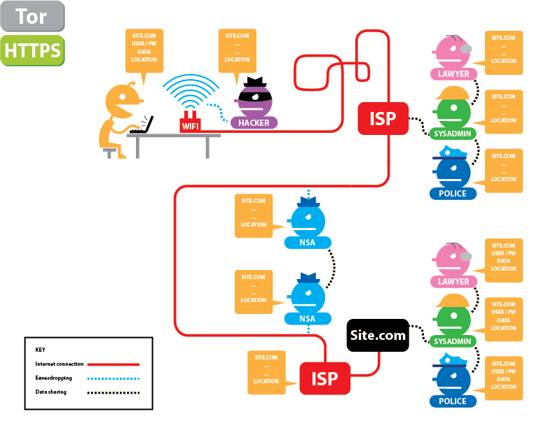
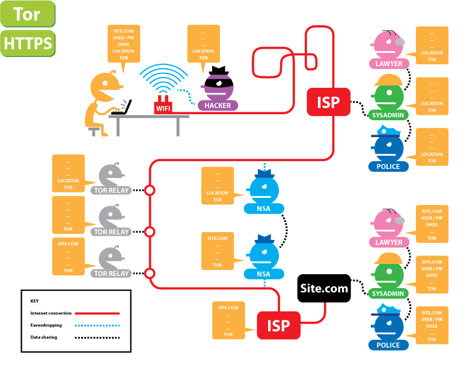

% Plating Onions
% Caio Volpato (caioau) \
  [caioau.keybase.pub](https://caioau.keybase.pub/) → [caioauheyuuiavlc.onion](http://caioauheyuuiavlc.onion/) \
    210B C5A4 14FD 9274 6B6A  250E **EFF5 B2E1 80F2 94CE** \
    All Copylefts are beautiful: licensed under [CC BY-SA 4.0](https://creativecommons.org/licenses/by-sa/4.0/)
% [Laboratório Hacker de Campinas -- LHC](https://lhc.net.br) 

---
title: 'Plating Onions'
subtitle: 'What is Tor? How to use? and how to run a relay'
date: Cryptorave 2019
author:
- Caio Volpato (caioau) [caioau.keybase.pub](https://caioau.keybase.pub/)
linkcolor: blue
urlcolor: blue
theme:
- Darmstadt
colortheme:
- rose
...

## Summary:

* What's Tor?
* Demystifying the deep/dark web
* How to use Tor Browser
* Cool stuff made with Tor
* Running a relay!

<!---

This slide is generated using pandoc with beamer, to generate the slides pdf run:

pandoc -t beamer input.md -o output.pdf

if you dont have pandoc: 

sudo apt install pandoc texlive-latex-recommended

read pandoc manual:

https://pandoc.org/MANUAL.html#producing-slide-shows-with-pandoc

TODO:

- [x] copy from previous casa hacker slides
- [x] cool stuff with tor: whonix, tails, onionshare, secure drop, ricochet, briar
- [x] tor relay: torrc templates and for bridges, firewall (ufw), unattended upgrades, swap, ssh hardening, ntp, vnstat munin? tune2fs
- [ ] raspy specifics: disable swap, fstab, rc.local to create log
- [x] tips: yubikey, ssh config blocks and onion service, magic wormhole? port knocking

- [x] anonimous upgrades

- [x] onion lists: ddg, debian, bbc, facebook, protonmail, 
- [ ] tor mirrors
- [ ] about casa hacker and cebolas

- [x] tor relay lifecycle

- [ ] rpi file

- [x] sshd_config, torrc , source.list, unnatended upgrades
- [x] port knockig
- [ ] debian security mailing list, tor relay list

- [ ] tshirt and fallback dir


https://community.torproject.org/training/resources/

-->

--- 

### About Casahacker hackerspace:


---

### About the cebolas collective:

---

### Acknowledgments 

This presentation would not be possible without the help of this awesome Tor people: **Cybelle**, **ggus** and **egypcio**


---

## Tor

Tor -- The onion router, is a libre software that enables communicating anonymously and privately.

---

## Tor

### Demystifying Tor: Myths

> - Deep web? Dark web? Hackers? Illegal stuff?
> - Deep dark web much bigger than Google, Facebook and YouTube?
> - When you use Tor bad things can happen to you such entering the FBI most wanted?
> - Using Tor means entering suspicious sites ?


---

## Demystifying Tor: Facts

### So, Whats this Tor is all about?

> - A libre software used for bypassing censorship, surveillance and tracking on the web.
> - Who uses and supports Tor? 
>     + Privacy NGOs: Like EFF and Calyx Institute.
>     + Humans rights defenders and LGBTQIA+: such Human Rights Watch.
>     + Journalists: Such as BuzzFeed, Huffington Post
>     + Several companies such as facebook and cloudflare.
>     + The police and law enforcement.

---

## Demystifying Tor: Facts


### Whats Tor mission?

To advance human rights and freedoms by creating and deploying free and open source anonymity and privacy technologies, supporting their unrestricted availability and use, and furthering their scientific and popular understanding.

---

### How Tor works:

{height=300px}

---

### **Without** Tor: [Tor and SSL](https://www.eff.org/pages/tor-and-https)

{height=300px}

---

### **With** Tor: [Tor and SSL](https://www.eff.org/pages/tor-and-https)

{height=300px}

---

### Getting started: Downloading Tor Browser:

1. Goto : [torproject.org](https://www.torproject.org) and select **Download**
2. Select your Operating System and also select the signature.
3. (**Highly encouraged**) Verify the signature: 
    1.  gpg \--keyserver=hkps://keys.openpgp.org \--recv-keys 0xEB774491D9FF06E2
    2.  gpg \--verify tor-browser-linux64-9.0.1_en-US.tar.xz.asc
4. Extract and Run the Tor Browser.

### Downloading Tor Browsing When censored:

TODO (twitter DM, github, mirrors)

---

### While using Tor Browser pay attention: 

* Your ISP (**only**) knows* that you are using Tor.
    + If you're under a hostile environment connect using Bridge (this way your ISP will not even know that you are using Tor).
* Only use Tor with the Tor Browser 
* Never BitTorrent on Tor.
* **Leave the Tor Browser as is (Don't install any extensions)**
* Avoid opening downloaded files from Tor Browser (Use Tails)

### Any questions? Read the Tor Browser User manual

Tor Browser has a user manual website under: [tb-manual.torproject.org](https://tb-manual.torproject.org/)

---

### Tor onion services

When using Tor, the connection have to leave the Tor network (via the Exit node), leaving that connection exposed. Also when using Tor on clearnet only protects the client, not the service.

Briefly: When using Onion service ( .onion domains) the client and the service each build a circuit to a rendezvous point.

### Onion service properties:

* Self authenticated.
* End to end encrypted.
* NAT punch builtin.
* No need to "leave" the Tor network.

---

### Just some onion services:

* Cryptorave: [utw4svtv5ccjastc.onion](http://utw4svtv5ccjastc.onion/)
* [Casa Hacker](https://casahacker.org): [casahackrd5564weeiw7biseh6oms5jatpfa5klfoobeworbksx4z2qd.onion](http://casahackrd5564weeiw7biseh6oms5jatpfa5klfoobeworbksx4z2qd.onion/)
* Debian: [onion.debian.org](https://onion.debian.org)
* QuebesOS: [qubesosfasa4zl44o4tws22di6kepyzfeqv3tg4e3ztknltfxqrymdad.onion](http://qubesosfasa4zl44o4tws22di6kepyzfeqv3tg4e3ztknltfxqrymdad.onion/)
* BBC: [bbcnewsv2vjtpsuy.onion](https://www.bbcnewsv2vjtpsuy.onion/)
* NYTimes: [nytimes3xbfgragh.onion](https://www.nytimes3xbfgragh.onion/)
* BuzzFeed: [bfnews3u2ox4m4ty.onion](https://bfnews3u2ox4m4ty.onion/)
* Facebook: [facebookcorewwwi.onion](https://facebookcorewwwi.onion/)
* DuckDuckGo: [3g2upl4pq6kufc4m.onion](https://3g2upl4pq6kufc4m.onion/)
* ProtonMail: [protonirockerxow.onion](https://protonirockerxow.onion/)
* [invidio.us](https://invidio.us/) : [axqzx4s6s54s32yentfqojs3x5i7faxza6xo3ehd4bzzsg2ii4fv2iid.onion](http://axqzx4s6s54s32yentfqojs3x5i7faxza6xo3ehd4bzzsg2ii4fv2iid.onion/)
* [riseup.net](https://riseup.net): [list](https://riseup.net/security/network-security/tor/hs-addresses-signed.txt)
* [keybase.io](https://keybase.io): [keybase5wmilwokqirssclfnsqrjdsi7jdir5wy7y7iu3tanwmtp6oid.onion](http://keybase5wmilwokqirssclfnsqrjdsi7jdir5wy7y7iu3tanwmtp6oid.onion/)

---

### Creating a onion service for your website:

Setting up a onion service for your website is super easy! No excuses for not doing it!

This can be done in two different ways:

1. Installing tor program on your server and pointing the onion service to your webserver:
    * Just follow the [setting up your onion service](https://community.torproject.org/onion-services/setup/)

2. Using [eotk](https://github.com/alecmuffett/eotk) -- The Enterprise Onion Toolkit to act as a reverse proxy.


* **Bonus points** if you use **alt-svc header** in your website, so when connecting to your website via Tor Browser it'll send its onion address via this header so it will connect to it transparently. Follow the [privacytools.io guide](https://write.privacytools.io/jonah/securing-services-with-tor-and-alt-svc)


* Also checkout the [onion balance](https://github.com/DonnchaC/onionbalance) that provides load-balancing and redundancy for Tor hidden services

---

### Cool stuff built on Tor:

* [ooni.torproject.org](https://ooni.torproject.org) -- Open Observatory of Network Interference
* secure drop: platform to submit documents.
* onion share: allow sharing files anonymously.
* Tails -- The Amnesic Incognito Live System.
* Whonix: Operating system that isolates the Tor program and Browser in separated VMs, can be installed on QuebesOS.
* Briar: p2p messenger.  
* Debian/QuebeOS anonymous updates.

---

### Running a Tor relay

The Tor project community created a awesome [Tor relay guide](https://community.torproject.org/relay/), with the following sections:

1. Types of relays.
2. Relay requirements.
3. Technical consideration.
4. Technical setup.
5. Community and legal resources
6. Getting help

---

### Running a Tor relay: Types of relays:

Understating the right type of relay for you is important given the legal implications.

When using Tor the connection goes like this:

You → Guard relay → middle relay → Exit relay → site.com

The entire path from you to site.com is called a **circuit**

So the Tor relays types are:

* Exit relay: Does the final connection to the desired websites, **requires huge legal support** since a random person can do illegal stuff and your Exit relay will be blamed for it. 
* Non-exit relay: A relay which will be either a middle or guard relay (more on that later).
* Bridge relay: Acts like a Guard relay, but since every Tor relay IP is public it can be easy censored, Bridges IPs are not public (optionally they could be only published to the bridgedb). **Are useful for Tor users under oppressive regimes.**

--- 

### Relay requirements:

* Bandwidth and Connections: Tor relay should be able to handle a lot of concurrent connections at least 70k~100k. 
For bandwidth it required at least 16 Mbps for upload and download, if you have less run a Bridge (1Mbps minimum)
**This is why you should not run a relay at home, a bridge maybe be okish**

* Monthly Outbound traffic: Tor relays needs a lot of traffic, **Ideally a relay runs on an unmetered plan**

* Public IPv4 Address 

* RAM memory requirements: Tor is very lightweight: 512MB should be fine for <= 40Mbps and 1GB for more.

* CPU: 1vCPU should be fine for most relays.

* Uptime: 2hr/day is the least required.

* Tor version: Older version are unsupported (EOL)

---

## Technical consideration:

### Choosing a hosting provider: 

Look the community doc: [Good Bad ISPs](https://community.torproject.org/relay/community-resources/good-bad-isps/) where most providers are listed if they allow (or not) hosting Tor.

Avoid as must as possible the following providers:

* OVH SAS (AS16276)
* Online S.a.s. (AS12876)
* Hetzner Online GmbH (AS24940)
* DigitalOcean, LLC (AS14061)

Try hosting in a AS and country that already has a lot of relays. Look in the metrics: [AS](https://metrics.torproject.org/rs.html#aggregate/as) and [Country](https://metrics.torproject.org/rs.html#aggregate/cc)

When looking for a provider **the most important thing is traffic quota, ideally look for unmetered.** 

(For me) the payment methods are important too: I always prefer bitcoin or at least PayPal.

---

## Technical consideration:

### Choosing a Operation System:

Most relays (like 90%) runs on Linux, and most of them are Debian based. This is bad because if a security vulnerability is to be found most of the network would be down.

There's a great effort to bring more diversity to the network, by encouraging BSD: [torbsd](https://torbsd.org/)

I'm most familiar to [OpenBSD](https://www.openbsd.org/) and it has great security features like:

* Only two remote holes in the default install, ever!
* KARL -- kernel address randomized link.
* Immune by design against Spectre & Meltdown.
* W ^ X memory.

[why OpenBSD rocks](https://why-openbsd.rocks/fact/)

Given that, **choose a OS that you're most familiar with.**

---

### Why I prefer Debian over other Linux:

* Rock solid stable.
* Not frequent updates (only security updates).
* Committed to Libre software (unlike Ubuntu, Fedora).
* All volunteers signs the Debian Social Contract.
* No profit organization (unlike Ubuntu, Fedora).
    + Ubuntu had a [spyware](https://www.eff.org/pt-br/deeplinks/2012/10/privacy-ubuntu-1210-amazon-ads-and-data-leaks) installed by default.
    
---

### A (very) brief introduction to systemd

systemd is a init system that manages system and services, It's been the default since Debian Jessie (2015)

Basic usage:

* Show system (or service) status

> sudo systemctl status [service]

* Enabling and disabling a service:

> sudo systemctl enable/disable service

* Starting and stopping a service:

> sudo systemctl start/stop service

* Restarting and reloading a service:

> sudo systemctl restart/reload service

The difference between restart and reload: Some services handle a Unix signal (normally SIGHUP) that tells the program to reload the configuration file without the need to stop and start (restarting) the service. No downtime!


---

### How to read systemd services logs: journalctl

Systemd centralizes all system and services in the journald daemon.

Basic usage:

* Show all the logs:

> sudo journalctl

* Filter by a unit (like a service) and date

> sudo journalctl -u service \--since 2019-11-25

---

### The actual setup:

In order to setup our relay we are going to:

* Creating a non root user (and giving it sudo rights).
* Removing unnecessary packages and services.
* ssh hardening.
* Firewall setup (ufw).
* Always having the correct time: ntp.
* Automatic updates (unattended-upgrades).
* Tor setup and install.
* Monitoring: nyx, vnstat and optionally munin.
* Misc recommend things and Tips.
* Raspberry pi specific things.


--- 

### Creating a non root user:

After creating your VM, the provider will send you the credentials to root (using and login as root is highly discouraged), so run:

```
apt update
apt install sudo
adduser USERNAME
usermod -aG sudo USERNAME
```

### Copying your ssh key to your new user:

If you don't have ssh key create it by running **on your local machine**:

> ssh-keygen -t ed25519 -o -a 300

Should I type a password to my ssh key, or leave it blank? For most cases putting a password is a [Security theater](https://en.wikipedia.org/wiki/Security_theater)

Now copy your key to the server:

> ssh-copy-id -i ~/.ssh/id_ed25519 username@server


---

### Removing unnecessary packages and services:

Se what services are started and boot:

> systemd-analyze blame

the following services are safe to disable:

* bluetooth 
* accounts-daemon
* avahi-daemon
* ModemManager
* pppd-dns
* wpa_supplicant (if not using WiFi)

Also install htop to see running process:

> sudo apt install htop

Then look for non-standard process, the remove it with sudo apt remove package.

### Always having the correct time: ntp

tor needs that your server is always with the correct time, just install the ntp:

> sudo apt install ntp

---

### ssh hardening:

#### Generate new host keys:

We have no guarantee that your provider is not using the same ssh host keys for everyone.

```
sudo -s
cd /etc/ssh
rm ssh_host_*
ssh-keygen -t rsa -b 4096 -f ssh_host_rsa_key
ssh-keygen -t ed25519 -f ssh_host_ed25519_key
```

---

#### sshd config : TODO colocar link 

```
# /etc/ssh/sshd_config
Port 123456 # FIXME: change the default port
HostKeyAlgorithms ssh-ed25519-cert-v01@openssh.com,ssh-rsa-cert-v01@openssh.com,ssh-ed25519,ssh-rsa
KexAlgorithms curve25519-sha256@libssh.org,diffie-hellman-group16-sha512,diffie-hellman-group18-sha512,diffie-hellman-group14-sha256
Ciphers chacha20-poly1305@openssh.com,aes256-gcm@openssh.com,aes128-gcm@openssh.com,aes256-ctr,aes192-ctr,aes128-ctr
MACs hmac-sha2-512-etm@openssh.com,hmac-sha2-256-etm@openssh.com,umac-128-etm@openssh.com 
LoginGraceTime 1m
PermitRootLogin no
# TODO: copy your ssh key than disable password login
PubkeyAuthentication yes
PasswordAuthentication no
PermitEmptyPasswords no
UsePrivilegeSeparation sandbox
ClientAliveInterval 10
```

---

### Bonus: What to do with the default ssh port -- 22 free:

As the previous step you really should change the sshd port, but what to do with the 22 port? You can:

* Have a ssh honeypot: [cowrie](https://github.com/cowrie/cowrie)
    + Or use HaaS -- Honeypot as a service: [haas.nic.cz](https://haas.nic.cz/)
* (What I recommend): ssh tarpit: [endlessh](https://github.com/skeeto/endlessh)
    + This creates a herd immunity against ssh bots so protecting vulnerable machines that could be exploited.

---

### Firewall (ufw):

ufw is a easy to use firewall built on netfilter and iptables.

* Installing ufw:

> sudo apt install ufw

* Enabling it:

```
sudo ufw default deny incoming # (1)
sudo ufw limit SSHPORT
sudo ufw allow 443 # ORPORT
sudo ufw allow 80  # DIRPORT
sudo ufw allow 22  # ssh
sudo ufw enable
```

(1) this will set the default policy to incoming packages: deny incoming packages, unless the ports we allowed.

(recommended): keep your current terminal opened, then open a new terminal and try ssh-in , this way if you get lockout you still have a terminal open to get yourself in.

---

### Automatic updates (unattended-upgrades).

No need to say that keeping your system always updated is essential.

* Install unattended-upgrades package:

> sudo apt install unattended-upgrades

* Enable it: run the following and select to enable automatic upgrades:

> sudo dpkg-reconfigure unattended-upgrades

* Configuration: TODO: github link

**Change buster to the current stable name at the time!**

And the packages origins to whitelist it, to do this list the installed packages origins: 

> apt-cache policy | grep release

Now your server should auto upgrade and if needed it'll reboot

* Testing:

> sudo unattended-upgrade \--debug \--dry-run

---

### Actual Tor install and setup

Now we will install the tor from the project repository:

> sudo apt install apt-transport-https

if you are running a bridge also install obfs4proxy

* Adding the repository:

**Change buster to the current stable name at the time!**

```
# /etc/apt/sources.list.d/tor.list

deb https://deb.torproject.org/torproject.org buster main
deb-src https://deb.torproject.org/torproject.org buster main
```

* Adding and trusting the repository key:

> curl https://deb.torproject.org/torproject.org/A3C4F0F979CAA22CDBA8F512EE8CBC9E886DDD89.asc | sudo apt-key add

* Installing:

```
sudo apt update
sudo apt install tor deb.torproject.org-keyring
```

---

### Tor setup:

Download my torrc template files:

* non-exit torrc template file.
* bridge torrc template file.

Change to suit your needs: Nickname, ContactInfo.

Try as much as possible to keep Orport to 443 and dirport to 80.

Tips on how to deal with traffic quotas on the next slide.

then replace your edited torrc to /etc/tor/torrc and restart Tor:

> sudo systemctl restart tor

TODO: private bridge and get bridge line

---

## Tor setup: 

### Configuring for traffic quota:

It this example we are configuring for a provider that allows 2TB/month for Download + upload (some provider on charge for upload).

If we have 2TB for both directions, we have 1TB per direction.

* Calculate average speed:

Go to [WolframAlpha](https://www.wolframalpha.com/) and type 1TB/month: **we get 3.04 Mbps**.

Since we have only a small amount of bandwidth to donate compared to your connection speed, its advised to set accounting the quota daily, and setup the RelayBandwidthRate to 2~3 times the avg speed. 

* Get the daily quota 

type (1TB/month)*day on WolframAlpha: **we get 32.88GB daily traffic**

So your torrc should have (don't forget to reload tor):

```
RelayBandwidthRate 10 MBits
RelayBandwidthBurst 50 MBits
AccountingStart day 0:00
AccountingMax 32 GBytes
AccountingRule max 
```

this way your relay will always be useful for at least a third of each day and will use all of its quota (will not be under used).

---

### Tor setup: finishing up:

Everything should be working, just look for the Tor log (/var/log/tor/notice.log) if it's everything all right, like this:

```
Self-testing indicates your ORPort is reachable from the outside. Excellent.
Publishing server descriptor.
```

So your relay should be running :)

Wait for a couple of hours, then search for your relay at the [Tor Metrics: Relay Search](https://metrics.torproject.org/rs.html) 

(for bridges use the hashed-fingerprint value under /var/lib/tor)

* If you are running more relay: awesome! But don't forget to set MyFamily on your torrc

---

### Monitoring:

After having setting up your relay, you can almost leave as is, but it's important to monitor your system's:

1. CPU, memory, swap
2. Bandwidth.
3. Established connections.

The 1st you can monitor with **htop**, the 2st with **vnstat** and 3st with **nyx**.

nyx is a command line monitor for Tor.

Additionally you can also install munin, it's the most complete way to monitor your system and generates several charts, so you don't need to login every time to see how is your system. Checkout the [munin tor plugin](https://github.com/daftaupe/munin-tor).

---

## Misc recommended stuff and Tips

### Having a lot of swap:

While 1GB of RAM is enough for most relays, sometimes for a short period the system memory is full so the out of memory killer kills tor :/ 

After setting up swap it never happened, so having 1~3GB of swap is wise.

1. You can have a swap file and point it in the fstab.
2. (What I recommend) Use zram: It's fast than disk swap, just install the bc package and this [package](https://apt.galliumos.org/pool/main/z/zram-config/zram-config_0.5-galliumos2_all.deb)

### Avoiding disks errors: enabling file system check every boot:

One time my relay was down, after logging the file system was mounted as read only, I saw that was some errors on disk so the OS remounted as read only, after enabling fsck every boot solved, never had again:

Which device is rootfs? run `lsblk` than look the column name have the pointpoint // for instance /dev/vda1 , then `sudo tune2fs -c 1 /dev/vda1`

### Using ssh blocks:

This is really handy, instead of doing:

> ssh username@123.456.789.012 -p SSHPORT

Using ssh block we can do:

> ssh torrelay

```
# ~/.ssh/config

host torrelay
   HostName 123.456.789.012
   User username
   Compression yes
   IdentitiesOnly yes
   IdentityFile ~/.ssh/id_ed25519
```

### secure your sshd even more with port knocking

We are not using sshd on the default 22 port and only allowed public key authentication, this is quite secure, but we still have a exposed port to the internet.

Port knocking works likes this: In your case the ssh port is not open, then if I want to connect to my server I have to knock (connect) a secret sequence of ports, then the ssh port will be open for some time just for me.

Install the knockd on Debian.

### Super secure ssh keys: using security keys (like yubikey)

We are using ssh keys to login to the server, while this is safer than passwords, if your computer gets compromised your ssh keys can be leaked.

You can use firejail to prevent this, or use [ssh split](https://kushaldas.in/posts/using-split-ssh-in-qubesos-4-0.html) on QubeOS.

As a permanent solution I would suggest using a security key, like yubikey, the private key is securely stored on a separated hardware and will never leave it. 

If you have a yubikey: checkout [drduh guide](https://github.com/drduh/YubiKey-Guide)

Future versions of OpenSSH will support using any u2f token as a security key, so you can use a inexpensive (~12USD) [tomu](http://tomu.im/tomu.html)

### Transferring files magically: Using magic-wormhole

While you can use scp or rsync to copy files over ssh, magic-wormhole is so much easier :)

### Using anonymous upgrades

Debian and tor project offers their packages to be downloaded via onion service, it's always safer to use onion over clearnet.

* Install apt over tor transport package:

> sudo apt install apt-transport-tor

Then comment your /etc/source.list and other files under /etc/apt/source.list.d/, then copy the onion part from the TODO 

### ansible

https://github.com/nusenu/ansible-relayor

---

### Raspberry pi specific stuff:

Modern raspis are powerful enough to run a Tor relay, but since their hard drive is a SD card is not as reliable and have shorter lifespan as a regular HDD, so it's recommended some measures to reduce the writes to disk and prolong it's lifespan

disable swap, zram, fstab, rc creating tor logfile, fstrim

---

### The lifecycle of a new relay:

I just setup my relay but it's not fully using bandwidth.

The Tor network have this mechanism to slowly ramp new relay, it takes some weeks to a new relay to be fully used.

This post have all the details: [The lifecycle of a new relay](https://blog.torproject.org/lifecycle-new-relay)

Because of this it's recommended to **backup the relays keys**, so if you move your relay it won't start from scratch. Copy the folder /var/lib/tor/keys/

---

### Reaching out:

tor relay list and channel

tor global south list and channel

cebolas list and channel

---

### How to help tor project: 

voluntaring, donating, snowflake bridge
