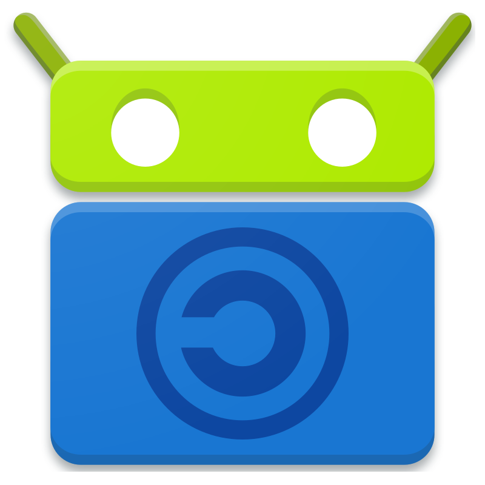
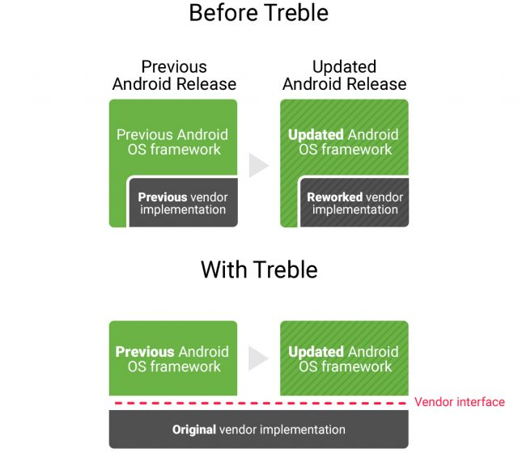

% Android Livre e Privado para os 99%
% Caio Volpato (caioau) \
  [caioau.keybase.pub](https://caioau.keybase.pub/) \
    210B C5A4 14FD 9274 6B6A  250E **EFF5 B2E1 80F2 94CE** \
    Todos os copylefts são lindos, licenciado sob: [CC BY-SA 4.0](https://creativecommons.org/licenses/by-sa/4.0/)
% [Hacking rocking bits -- 11 Novembro 2020](https://casahacker.org/) 

---
title: 'Android Livre e Privado para os 99%'
subtitle: 'O que é e como usar GMS, ROMs, Fdroid e MicroG'
date: Nov 2020
author:
- Caio Volpato (caioau) ([\@caioauv](https://twitter.com/caioauv)) [caioau.keybase.pub](https://caioau.keybase.pub/)
linkcolor: blue
urlcolor: blue
theme:
- Darmstadt
...

## Resumo:

* Como seu Android te espiona
* Como instalar ROMs livres
* Fdroid: Apps livres e alternativas aos tradicionais
* MicroG: O melhor dos dois mundos
* Dicas e boas praticas de segurança

<!---

This slide is generated using pandoc with beamer, to generate the slides pdf run:

pandoc -t beamer input.md -o output.pdf

if you dont have pandoc: 

sudo apt install pandoc texlive-latex-recommended

read pandoc manual:

https://pandoc.org/MANUAL.html#producing-slide-shows-with-pandoc

--->

---

### Casa hacker hackerspace

A Casa Hacker é um espaço hacker sem fins lucrativos e 100% dedicada a colocar comunidades locais no controle de suas experiências digitais e a moldarem o futuro da tecnologia da informação e comunicação para o bem público. Nós colocamos nossos princípios acima dos lucros e acreditamos que as tecnologias da nossa era são recursos públicos a serem explorados e construídos por todos, não uma mercadoria a ser vendida. Em um coletivo experiente, multidisciplinar e líder em tecnologia e sociedade desenvolvemos iniciativas de impacto social que empodera pessoas e transforma comunidades.

* Localizado em Campinas (campo grande).
* Website: [casahacker.org](https://casahacker.org)
* Redes sociais: @casahacker
* Mastodon: [\@casahacker@masto.donte.com.br](https://masto.donte.com.br/@casahacker)

---

### Atenção: Aviso legal!

As visões e opiniões expressas nessa atividade são de responsabilidade apenas do autor e não de seus empregadores.

---

### O Que é o Android?

O Android presente no celular que a gente compra feito pelos fabricantes (oem) são baseados no: 

* kernel Linux modificado para funcionar no chipset (vendor, por ex. qualcomm). 
* AOSP -- android open source project , que é de código aberto
* "Ecosistema" Google: GAPPS ou Play Services ou GMS -- Google Mobile Services

Em cima disso os fabricantes fazem suas modificações para implementar suas funcionalidades e apps exclusivos.

---

### O que é GMS?

O GMS é o "ecosistema" proprietário do Google, com ele é possivel usar Google Calendar, sincronizar contatos, backup das fotos e Whatsapp, Maps, etc ...

É incluído na partição "do sistema", que como é de apenas leitura, não pode ser desativado ou excluído pelo usuário.

Além disso tem acesso privilegiado ao celular, podendo acessar diversas permissões e privilégios de super usuário.

---

### Escândalo: em 2017 o Google coletava a localização mesmo com localização desativada:

O Google assumiu que em 2017, mesmo se o celular estiver com a localização completamente desativada o google, através das torres telefônicas coletava secretamente a localização:

Fonte: [Google collects Android users’ locations even when location services are disabled](https://qz.com/1131515/google-collects-android-users-locations-even-when-location-services-are-disabled/)

---

### Google Takeout: Baixe todos os dados que o Google tem sobre você

[takeout.google.com](https://takeout.google.com) Permite baixar todos os Emails, fotos, histórico de localização, arquivos do Drive, etc ...

Ao baixar os dados de localização, repare os arquivos JSON, que existe um atributo de "tipo", indicando se estava parado, de carro, etc ...

(“STILL”, “IN_ROAD_VEHICLE”, “IN_VEHICLE”, “EXITING_VEHICLE”, “vehicle_personal_confidence”, “WALKING”, “RUNNING”, “ON_FOOT”, “TILTING”, “IN_RAIL_VEHICLE”, “ON_BICYCLE”, and “UNKNOWN.”)

---

### Desativando o histórico de localização

[myactivity.google.com/myactivity](https://myactivity.google.com/myactivity) Permite pausar e deletar "minhas atividades", como histórico de navegação, localização, etc ...

---

### Apps com rastreadores

[reports.exodus-privacy.eu.org](https://reports.exodus-privacy.eu.org/en/) Audita os apps para os rastreadores, é possível ver quais rastreadores um app tem.

Infelizmente, a maioria dos apps populares tem rastreadores

---

### Fdroid

{height=80px}

A Fdroid é uma "app store" que respeita a privacidade e liberdade, contendo apenas com apps livres

Basta abrir seu browser em [f-droid.org](https://f-droid.org/), baixar o apk e instalar.

---

## Fdroid: Recomendações de Apps:

### Simple Mobile tools (apps laranja)

* galeria
* calendário
* Gerenciador de arquivos

---

## Fdroid: Recomendações de Apps:

### Comunicadores:

* Telegram FOSS: Fork livre do Telegram
* Briar: Comunicador anonimo, descentralizado, via Tor
* Conversations: XMPP com criptografia OTR e OMEMO.
* Matrix: Riot.im, element, syphon.
* Signal (não tem na fdroid).
* Jitsi Meet: Videoconferências Jitsi

---

## Fdroid: Recomendações de Apps:

### Jogos: 

* 1010! 
* Klooni 
* 2048

---

## Fdroid: Recomendações de Apps:

### Navegadores

* Firefox Fennec
* Firefox Klar (firefox focus)
* Privacy Browser
* Tor Browser for Android (habilite o repo do guardian project: settings → repositórios → habilite guardian project)
* Brave Browser (não tem na Fdroid)
* [Bromite](https://www.bromite.org/) (tem seu repo fdroid próprio
* WebApps Sandboxed browser Android app: Use WebApps com privacidade e segurança

---

## Fdroid: Recomendações de Apps:

### Redes sociais:

* twidere (twitter)
* Slide (reddit)
* Fediverse/Mastodon: Fedilab, Tusky

---

## Fdroid: Recomendações de Apps:

### Segurança:

* Aegis (autenticação 2FA, permite backup)
* Gerenciador de senhas: KeePassDX, LessPass
* Shelter: Isole os apps
* PilferShush Jammer: bloqueie o uso do mic.
* Orbot: Conecte na Tor
* Netguard: Firewall e adblock
* Openkeychain: Use criptografia PGP
* VPN: OpenVPN for Android, Wireguard, Riseup VPN, Calyx VPN, ProtonVPN.

---

## Fdroid: Recomendações de Apps:

### Multimídia: 

* OpenCamera
* NewPipe (youtube)
* AntennaPod (podcasts)
* Vinyl (player de musica)
* VLC
* DroidShows: Navegador de series de TV.

---

## Fdroid: Recomendações de Apps:

### Outros:

* Aurora Store: Baixe e atualize apps da play store.
* Etar: Calendário completo
* Exodus: Mostra os trackers de apps instalados
* Gadgetbridge (smart watches)
* Markor (editor texto, suporta markdown), Standard Notes (notas criptografadas online)
* Teclado: AnySoftKeyboard, OpenBoard
* Email: K-9 Mail, FairEmail, Tutanota
* Adblock: TrackerControl, Blokada, AdAway
* OsmAnd+: Alternativa ao waze (navegador)
* Transportr: Alternativa ao Moovit (transporte publico)
* RunnerUp: Alternativa ao strava (monitoramento ex fisico)

---

## Fdroid: Recomendações de Apps:

### Outros:

* Imagepipe: Remove metadados das fotos
* Syncthing: Sincronize seus arquivos entre seus dispositivos
* Nextcloud:
* Port Authority: Scanner de rede
* MoneyWallet: Gerencie suas finanças
* Forecastie: Previsão do tempo
* DAVx5: Sincronize calendário e contatos com nextcloud
* Termux: Terminal com pacotes
* Loop Habit Tracker: Lembre e acompanhe seus habitos.
* Goodtime: Timer pomodoro.

---

## Vivendo sem a nuvem:

### Nextcloud

Nextcloud é um software servidor de "nuvem" similar ao Dropbox, porém com mais funcionalidades como kanban tipo trelo e editar de forma colaborativa docs.

Permite sincronizar contatos e calendário usando o apps da Fdroid **DavX5** (antigo davdroid). No computador é possivel acessar pelo navegador ou thunderbird (extensão lightning)

Você pode procurar um provider gratuito de Nextcloud, como: [woelkli](https://woelkli.com), [framasoft](https://degooglisons-internet.org/en/list/), [https://www.systemli.org/](https://www.systemli.org/) e [disroot](https://disroot.org)

Outra opção é hospedar sua própria instancia nextcloud, alugando uma VPS na digitalOcean, hetzner, linode, etc ...

### DecSync CC

Outra opção é usar o app DecSync CC, que sincroniza contatos e calendário no armazenamento interno do celular e podendo sincronizar com syncthing

---

## Vivendo sem a nuvem:

### Syncthing

{height=40px}

Syncthing é um app que permite sincronizar arquivos entre seu Android e seu computador (ou outro android), dessa forma conseguimos fazer backup de fotos, chats de WhatsApp e Signal, apenas usando seus próprios dispositivos.

Para usar, instale o app da Fdroid, e no seu computador (no site tem as instruções), abra o app no cel e no pc, e linke os dispositivos em exibir ID do dispositivo. Pronto, basta escolher uma pasta e compartilhar com o pc.

Texto: [Como parei de me preocupar e passei a adorar minha solução de backups](https://caioau.keybase.pub/blog/backups/): Instruções de como fazer backups com syncthing no Android e borg no pc (usando uma raspberry pi).

---

### MicroG

O GMS, é um risco grande pra privacidade e segurança, é tentador querer viver totalmente sem GMS, porém a maioria dos apps populares não funciona sem.

Uma alternativa é o Microg: [microg.org](https://microg.org/), é uma implementação livre do GMS, feita apartir de engenharia reversa, que permite utilizar os serviços google com privacidade.

Porém para utilizar o MicroG, a ROM deve suportar **signature spoofing**, para que o microg finja ser o GMS.

---

### Esse app funciona sem GMS? e com microg? 

O Plexus é uma colaboração coletiva para catalogar se vários apps funcionam sem GMS, e com Microg.

[github.com/techlore-official/plexus](https://github.com/techlore-official/plexus)

Funcionam bem:

* WhatsApp, Slack, discord, intagram, twitter, tiktok
* Amoung Us
* Waze
* Apps de banco: itau

Não funcionam:

* Uber, 99Taxi

---

### WebApps

Para os apps que não funcionam sem GMS, mesmo com Microg, podemos utilizar suas versões webapp, ou seja pelo navegador

Uber: [m.uber.com](https://m.uber.com)

IFood: [m.ifood.com.br](https://m.ifood.com.br/)

Para mais privacidade e segurança o app [webapps sandboxed browser](https://f-droid.org/en/packages/com.tobykurien.webapps/)

---

### ROMs

ROMs são sistemas operacionais alternativos ao original, geralmente são mais leves, tem melhor performance e bateria.

Além de ter mais funcionalidades e varias opções de customização.

Outra vantagem é que como são mantidas pela comunidade, permite dar uma sobrevida aos celulares que o fabricante não da mais suporte.

As ROMs mais conhecidas são:

* [Lineage](https://lineageos.org/) (antigo cyanogenmod): suporte a vários dispositivos.
* [OmniROM](https://omnirom.org/), [Resurrection Remix](https://resurrectionremix.com/), [Pixel Experience](https://download.pixelexperience.org/), [Havoc-OS](https://havoc-os.com/index.html) e [MSM Xtended](https://msmxtended.org/)
* [LineageOS for microG](https://lineage.microg.org/): Lineage com microG incluso.
* [/e/](https://e.foundation/): ROM amigável com microg.
* [CalyxOS](https://calyxos.org/): Suporta basicamente Pixel, com microg e apps de segurança e privacidade inclusos.
* [GrapheneOS](https://grapheneos.org/): (antigo copperheadOS): Foco em segurança (apenas pixel).
* [Replicant](https://replicant.us/): ROM 100% software livre, endossada pela FSF

---

### Como instalar a ROM

Procure as instruções para seu modelo, mas em linhas gerais consiste de:

1. Instale no seu pc o adb e fastboot
2. Baixe a ROM e o TWRP para seu dispositivo (e as assinaturas).
3. Verifique o download: com os comandos `sha256` e `gpg --verify`.
4. Desbloqueie o bootloader
5. Instale o TWRP
6. Faça um wipe no TWRP e instale a ROM
7. ~~Instale OpenGapps~~
8. Reinicie o celular! Fim!

### Atenção: 

Desbloquear o bootloader do seu celular vai anular sua garantia! Tenha certeza que quer fazer isso!

---

### trocafone: Celulares seminovos bem baratos:

A [trocafone](https://www.trocafone.com/) é uma loja virtual e física que vende celulares semi novos em ótimo estado por um preço bem acessível.

---

### Projeto treble

E se meu aparelho não é suportado pelas ROMs? 

{height=200px}

Aparelhos recentes tem suporte completo ao treble, que permite usar ROMs com imagens genericas: GSI -- Generic System Image.

Vá na wiki do [Treble Experimentations](https://github.com/phhusson/treble_experimentations/wiki) e veja a lista de ROMs que produzem GSI e instruções.

---

### Como instalar apps da Play store: Aurora store

Como instalar apps da Play store? Ao invés de usar sites como apkmirror, na Fdroid tem um app chamado **Aurora Store**, que permite acessar a play store de forma livre, dessa forma os apps são atualizados facilmente.

---

### #FreeYourAndroid

a fundação software livre da europa -- fsfe tem a campanha #FreeYourAndroid para libertar dispositivos Android.

Pag da campanha: [fsfe.org/activities/android](https://fsfe.org/activities/android/)

### SeedVault: Backups completos:

O SeedVault é um app livre para fazer backups completos (todos os dados dos apps, equivalente ao titanium backup), infelizmente não é possível instalar o seedvault, ele deve vir incluso no ROM.

Video demo: [video](https://peertube.co.uk/videos/watch/8d35afff-e6bc-4e9f-a24b-2ee3ce0314fe) 

Github: [github.com/seedvault-app/seedvault](https://github.com/seedvault-app/seedvault)

---

### Boas praticas de segurança: S&nh5s

* Meu texto: [O elo mais fraco da nossa segurança: S&nh5s](https://caioau.keybase.pub/blog/senhas/)
* Uma senha segura precisa ter: ser verdadeiramente aleatória, longa o suficiente (14+ caracteres) e mais importante facil de lembrar.
    + Método Diceware: [livreto](https://github.com/thoughtworks/dadoware)
    + exemplo: galera amanhã fabril naipe suspiro comício
* Use um gerenciador de senhas como KeePassXC (keepassdx no android) ou LessPass ou bitwarden.
* Habilite autenticação em 2 fatores: app Aegis da Fdroid.

---

### Boas praticas: WhatsApp:

* Habilite autenticação em 2 fatores: Configurações → Conta → Confirmação em 2 etapas.
* Desabilite o backup para google drive: Configurações → Conversas → Backup de conversas → Fazer backups no Google drive: Nunca

---

### Boas Praticas de Segurança: Android:
* [The Privacy Enthusiast's Guide to Using Android](http://lifehacker.com/the-privacy-enthusiasts-guide-to-using-android-1792432725): 
    + Use PinCode ou senha Forte (6+ dígitos **VERDADEIRAMENTE ALEATÓRIOS**).
    + tenha consciência que se você usa a digital para desbloquear seu aparelho podem te forçar você a colocar seu dedo.
    + "Esconda" notificações sensíveis da tela de bloqueio.
    + Desative "minhas atividades" do Google (histórico de buscas, localização, etc ...): [myactivity.google.com/myactivity](https://myactivity.google.com/myactivity)
    + Desative (ou não) o find my phone
    + Desative Backup do Google: histórico de chamadas, senhas do Wifi e Apps são salvos no Google.
    
---

### Boas Praticas de Segurança: Android:  

* Utilize o "dns privado": Dessa forma o DNS será criptografado, dificultando que sua operadora saiba quais sites está conectando. [Lista de provedores](https://privacytools.io/providers/dns/), pessoalmente recomendo [nextdns](https://nextdns.io/) ou [cloudflare](https://developers.cloudflare.com/1.1.1.1/setting-up-1.1.1.1/android)
* Desative permissões desnecessárias.
* Vá no app de Câmera e desabilite a opção de Geolocalização.
* Use o app chamado imagePipe que além de tirar metadados de fotos, reduz seu tamanho.

### Isole Apps sensíveis:

Recomendo o shelter (fdroid): ele cria um perfil isolado e permite usar apps de maneira isolada e permite "congelar" apps preservando sua privacidade.

### Bloqueie uso indevido do seu microfone:

Recomendo o app PilferShush Jammer (fdroid): ele bloqueia apps de usarem seu microfone. 

---

### Features Lineage:

* Embaralhar layout pincode: Previne que alguém observando você desbloqueando seu celular descubra seu pincode.
* Desative acesso a internet de um app: Vá na lista de apps → pressione continuamente → Informações do app → dados moveis e Wi-Fi → Permitir acesso à rede

---

### Resumo:

* Use senhas fortes (diceware), gerenciador de senhas (keepassxc no pc e keeepass dx no android)
* Habilite autenticação em 2 etapas (inclusive no whatsapp).
* Desabilite "minhas atividades": [myactivity.google.com/myactivity](https://myactivity.google.com/myactivity)
* Use apps livres da fdroid.
* Isole apps com shelter.
* Utilize o "dns privado".
* Desabilite backup no Google Drive no WhatsApp
* Faça backups com syncthing

### Caso perder a garantia do seu aparelho não seja problema:

* Instale um ROM como lineage, sem Gapps, se quiser com microg
* Caso seu aparelho não está disponivel nas ROMs procure no [Treble Experimentations](https://github.com/phhusson/treble_experimentations/wiki) por GSI

---

### Referencias

* Curso [Android Embarcado Sergio Prado](https://e-labworks.com/treinamentos/android-embarcado/).
* Youtube:
    + [Techlore](https://www.youtube.com/c/Techlore/videos)
    + [Rob Braxman Tech](https://www.youtube.com/c/BraxMe/videos)
    + [Wolfgang](https://www.youtube.com/watch?v=WSNGK9gmdpg)

