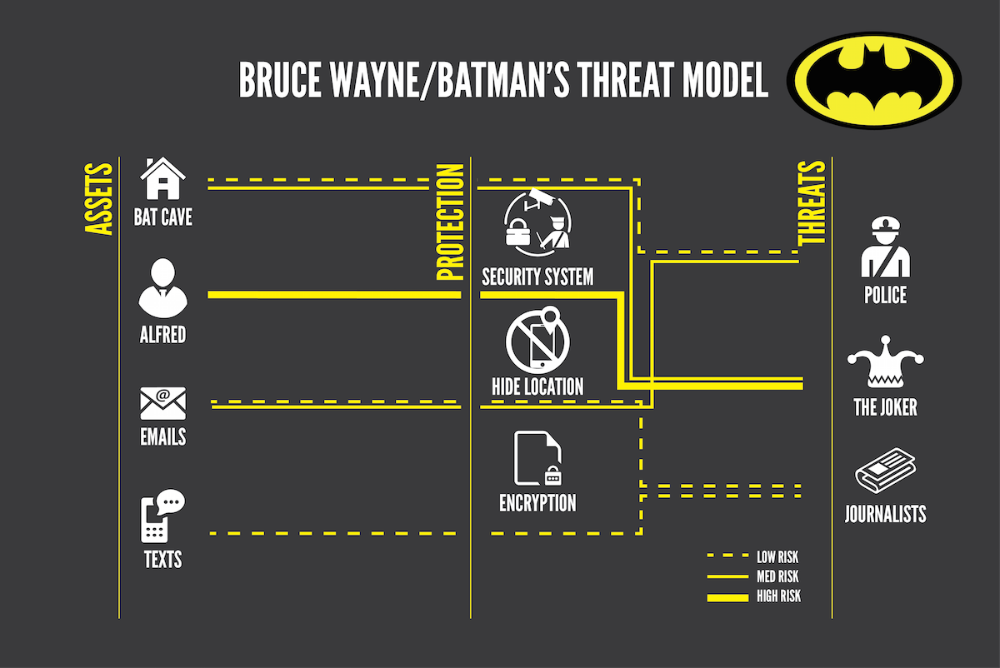

% Online privacy and security guide
% Caio Volpato (caioau) ([\@caioauv](https://twitter.com/caioauv)) [https://caioau.keybase.pub](https://caioau.keybase.pub/);
    210B C5A4 14FD 9274 6B6A  250E **EFF5 B2E1 80F2 94CE**
% Eldorado tech talks

---
title: 'Online privacy and security guide'
subtitle: ''
date: Eldorado tech talks
author:
- Caio Volpato (caioau) ([\@caioauv](https://twitter.com/caioauv)) [caioau.keybase.pub](https://caioau.keybase.pub/)
- 210B C5A4 14FD 9274 6B6A  250E **EFF5 B2E1 80F2 94CE**
linkcolor: blue
urlcolor: blue
theme:
- Darmstadt
...


## Summary:


* OPSEC - Threat modeling.
* Everything on passwords.
* Browsing with privacy.
* Privacy and security best practices for your devices.
* Libre and privacy-respecting alternatives.

---

## OPSEC

> Security is the opposite of paranoia. 

---

## OPSEC

### What is OPSEC ?

Operations Security -- OPSEC is about minimizing attack surfaces and single points of failure through proper habits and policies. It's a systematic and proven process that we can use to deny adversaries information they need to do us harm or interrupt our plans.

---

## OPSEC

### The OPSEC Process

1. Identify the information you need to protect
2. Analyze the threats
3. Analyze your vulnerabilities
4. Assess the risk
5. Apply countermeasures 

* Understand your own risk/threat model: Who is your adversary? What needs protecting?

* The OPSEC Two-Step: Know what to protect and know how to protect it.

---

## OPSEC

### Glossary: Some important definitions:

* Entity: Main actor of the model, can be an individual, an organization.
* Threat: It is any form of attack against the Entity. 
* Asset: It is everything that belongs to the Entity.
* Mitigation: Is a way to dispel a threat.
* Adversary: An actor that promotes threats and is defined as having conflicting interests with other actors.
* Risk: The possibility of threat occurring. 

---

### Properties of those elements:

* Asset:
    + type.
    + history.
    + amount.
    + importance.
    + threats.

* Threat:
    + probability of threat to occur: P{0,1}.
    + severity: how much the threat compromises assets.
    + mitigations 
    
* Mitigation:
    + cost
    + efficiency: P{0,1}.
    + threats.
    
---

### Relationship between those elements: 

```
                   .- mitigation 1
                  /
       .- threat 1 -- mitigation 2
      /
Asset --  threat 2 -- mitigation 3
      \
       `- threat n -- mitigation 4
                 \
                  `-- mitigation n

```
    
---

{width=400px}

---

### EFF five questions:

1. What do you want to protect? 
    * The data, communications, and other things that could cause problems for you if misused.
2. Who do you want to protect it from? 
    * The people, organizations, and criminal actors who might seek access to that stuff.
3. How likely is it that you will need to protect it?
    * Your personal level of exposure to those threats.
4. How bad are the consequences if you fail?
5. How much trouble are you willing to go through in order to try to prevent those? 
    * The money, time and convenience you're willing to dispense with to protect those things.

---

## OPSEC

### further reading: 

* (PT) [plano.autodefesa.org](https://plano.autodefesa.org)
* [EFF -- Surveillance Self-Defense](https://ssd.eff.org)
* [How I learned to stop worrying (mostly) and love my threat model](https://arstechnica.com/information-technology/2017/07/how-i-learned-to-stop-worrying-mostly-and-love-my-threat-model/)

### further listening (podcasts): 

* [The Privacy, Security, & OSINT Show -- 079-Revisit Your Threat Model](https://inteltechniques.com/blog/2018/05/11/the-complete-privacy-security-podcast-episode-079/)
* [Reply all -- #130 The Snapchat Thief](https://gimletmedia.com/shows/reply-all/v4he6k/130-the-snapchat-thief)

---

## Everything on passwords

A secure password should take centuries to be cracked even if all computers in the world are used to do that, but in 2016 [LinkeDin passwords were leaked](https://blog.korelogic.com/blog/2016/05/19/linkedin_passwords_2016): there were 61 millions unique passwords and it only took 2 hours to break 65% of them.

---

## Everything on passwords

{width=230px}

---

## Everything on passwords

### Check if you've been compromised by any breach

[haveibeenpwned.com](https://haveibeenpwned.com)

{width=300px}

---

## Everything on passwords

### Distinguishing human generated random from real random

Imagine that two persons are turning on and off a light, one based on a coin flip and other other is trying to simulate randomness.

Can we determine which light is being switched by a coin flip?


---

## Everything on passwords

### Distinguishing human generated random from real random

{width=180px}

The answer is to count sequences of numbers, such as runs of three consecutive switches: A true random sequence will be equally likely to contain every sequence of any length (Frequency stability property).

---

## Everything on passwords

{width=300px}

---

## Everything on passwords

Humans favor certain sequences when they make guesses, one reason this happens is because we make the mistake of thinking certain outcomes are less random than others

This herd behavior results in more predictable passwords.


---

## Everything on passwords

### Diceware method for generating passwords

So our passwords are the worst, we need to create a password that is:

* Easy to remember.
* Truly random.
* Long enough.

The Diceware is a method to generate random secure passwords: It consists throwing a dice to select words from a wordlist.

[PT_BR wordlist](https://github.com/thoughtworks/dadoware) [EN wordlist](https://www.eff.org/dice)

---

## Everything on passwords

### Diceware complete method:

1. Get the wordlist
2. Make sure you are alone in the room and close the curtains, write on a hard surface (not on a pad of paper).
3. Throw the dice 5 times per word. 
    * example: 3, 1, 2, 4, 6 → flyer .
4. Do the 3rd step 6 times.
5. Throw again (maybe twice) to decide which word (or only the first letter) is going to be in uppercase.
6. Throw the dice 2 times to get a random number or symbol. 
7. Do the 6rd step 3~7 times.
8. Write and memorize and type it a few times, the final password.
9. After you memorize your passphrase, burn your notes, pulverize the ashes and flush them down the toilet. 

--- 


## Diceware method

### Examples of generated passwords:

1. Complete

> eligible compress 539=Spherical twelve /JAM{ anytime

Entropy=104 bits (1T/s = 643 billions years, 100T/s = 6.4 Bi)

2. Simple 

> cut subsonic luckiness unselfish librarian snowdrift

Entropy=77 bits (1T/s = 2.4 thousand years,100T/s=24 years)

3. Shorter : **using a dictionary (345k words)**

> reestablish disabled disease strette

Entropy=72 bits (1T/s = 150 years, **100T/s = 1,5 years**)

**Warning: That is not the time to break the password, but the time to go through all the combinations (the time to break will be on average half)** 

---

## Diceware method

Diceware is a method for creating secure passwords that is:

* Harder: Generated passwords are truly random making them harder to break.
* Better: Better to remember.
* Faster: Faster to create new passwords: just throw the dice or use a computer.
* Stronger: They have a lot of combinations making them much stronger.

---

## Password Manager

Now that we know how to create a secure password, how do we obtain an unique password for each service?

Password managers address that: it creates unique random passwords for each service, locked by a single master password

### Libre Password Manager recommendations:

* [KeePassXC](https://keepassxc.org/) stores locally on a database (change to argon2).
* [LessPass](https://lesspass.com)  stateless password manager.
* [Bitwarden](https://bitwarden.com/)  cloud password manager.

### On Android:

* **Warning: Don't use the clipboard to access your entries**, it's shared between all apps.

* Use the KeePass DX app, it was autofill service (and sync it with syncthing).

---

## Two factor authentication

The idea behind tho factor authentication (2FA) is in order to login you need two factors: your password (something that only you know) and your phone (something that only you have)

[turnon2fa.com](https://www.turnon2fa.com/) shows how to 2FA on every service.

Normally it's scanning an QR code with an app, andOTP is the recommended app.

---

## Two Factor authentication

 [Kill the Password: A String of Characters Won't Protect You](https://www.wired.com/2012/11/ff-mat-honan-password-hacker/).

{width=150px}

---

## Everything on passwords

### Two Factor authentication with SMS:

Using 2FA with SMS is bad news, because:

1. Can be used to compromise your privacy  ([like Facebook did](https://techcrunch.com/2018/09/27/yes-facebook-is-using-your-2fa-phone-number-to-target-you-with-ads/))
2. Can be intercepted (eg. ISMI-catchers) 
3. Your SIM card can be "cloned" (SIM swapping)
    * **Enable two step verification on your messengers.**
4. Can be snooped on the lock screen.
    * **Disable notifications on the lock screen.** 

---

## Security keys :

### 2FA is susceptible to phishing attacks

While 2FA is a very robust way to protect your accounts, it's prone to phishing attacks (where the attacker creates an identical login page and redirects the victim to it and enter the credentials and the 2FA code, now the attacker has access to the victim account).

### Security keys

The security keys is a stronger way to do two factor authentication, it uses the Universal 2nd Factor -- U2F authentication standard and uses public private keys generated within the security key to cryptography sign a challenge sent by the service, when logging the domain is sent to the security key so the phishing website could not get access the legitimate service key, always when accessing an service key it's necessary to physically touch an button on the security key.


---

## PinCodes:

](grid.png){width=220px}

---

## Pincodes

### In his great post Nick Berry analyzed 3.4 millions 4 digit Pincodes:

* The top 20 most used are responsible for 27% of the total.
* Statistically 1/3 of all pincodes can be guessed be trying only 61 combinations.
    + 50% can be guessed be 426 combinations (much less then 5000)
* Pincodes contain years (19XX) and dates (MMDD) are frequent.

---

## Android lock pattern

In the Android lock pattern (ALP, that 3x3 grid) there are 389112 possible combinations (using 6 digit pincodes is better)

### Tell me who you are, and I will tell you your lock pattern:

In her master thesis Marte Løge analyzed 4000 ALPs and concluded that humans are predictable 

---

## Everything on passwords

### (Definition): Side channel attacks:

Side channel attacks are focused on how the system is implemented, if it leaks some sensitive information that can intercepted by the attacker.

* Example: power analysis used to decode the private key 

{width=150px}

---

## Side Channel attacks 

### Using smartphone accelerometer to steal PIN 

At this paper [Stealing PINs via Mobile Sensors: Actual Risk versus User Perception](https://arxiv.org/pdf/1605.05549v1.pdf) the researchers were able to steal 80% of typed pins through an javascript on the browser

---

## Side Channel attacks 

### Using thermal cameras to steal PIN

At this video: [iPhone ATM PIN code hack- HOW TO PREVENT](https://youtu.be/8Vc-69M-UWk) he shows that is possible to steal pin via the heat left on the keypad

---

## Using thermal cameras to steal PIN

{height=200px}

the brighter keys are hotter so the typed pin is 12345

---

## Using thermal cameras to steal PIN

To defend yourself keep your fingers in all the keys while typing the pin.

{height=200px}

---

## Browsing with privacy

### How we are tracked while browsing:

* Browser fingerprint (which browser and version, screen size, fonts, installed plugins and extensions)
* pixel tags
* super cookies
* cookies
* web beacons

---

## Browsing with privacy

### The incognito tab is not really private:

visit [nothingprivate.ml](https://www.nothingprivate.ml) put your name in the box, close the windows then open again in the incognito tab, it will remember you, even if you use an VPN.

### further reading: 

* (PT)[Mãe é quem clica: estamos parindo crias do chupadados](https://chupadados.codingrights.org/vc-e-oq-vc-clica/) 

---

## Browsing with privacy

### browse privately: the easy way: [brave browser](https://brave.com/)

Free and open source browser that automatically blocks ads and trackers with fingerprint protection.

--- 

## Browsing with privacy

### browse privately: more complete approach: Hardened Firefox

Combining Firefox with hardened tweaks and add-ons

Just goto to [0xacab.org/caioau/firefox-hardening](https://0xacab.org/caioau/firefox-hardening) and follow the instrutions.

---

## Browsing with privacy

When accessing the internet your ISP knows what websites you are accessing (but don't know what you are doing, most sites have ssl enabled) and the website knows your real IP (so what city do you live), VPNs address that.

### VPNs 

VPN stands for virtual private network, this a tunnel connecting two networks, this way your ISP don't know which websites you are accessing and the website don't know your real IP.

---

## Browsing with privacy

### [VPN - a Very Precarious Narrative](https://schub.io/blog/2019/04/08/very-precarious-narrative.html)

VPNs are not an complete anonymity tool, because:

* Just moves the complete trust from your ISP to the VPN provider (does not reduce information).
* Acting as they do, and promoting commercial VPN providers as a solution to potential issues does more harm than good.
* In most circumstances, VPNs do very little to enhance your data security or privacy unless paired with other changes.  

---

## Browsing with privacy

### So I shouldn't use an VPN at all?

Using VPNs makes sense only when:

* Accessing private networks.
* When using an public WiFi.
* BitTorrent where it's illegal.

### How to use a VPN provider?

There's these two lists: [privacytools.io](https://www.privacytools.io/providers/vpn/) and [thatoneprivacysite.net](https://thatoneprivacysite.net/#detailed-vpn-comparison)

* Outside the fourteen eyes jurisdiction.
* Supports strong protocol (like OpenVPN).

---

## Tor

Tor stands for The onion routing network, while VPNs moves all the trust from your ISP to the VPN provider, Tor distributes that trust.

---

### How Tor works:

{height=200px}

---

### Which Tor node knows what?

* Bridge/guard
    + knows:
        + the Tor user's IP/location
        + middle node's IP/location 
    + doesn't know:
        + IP/location of exit node
        + message for middle node
        + message of exit node 

* Middle node
    + knows:
        + IP/location of bridge/guard
        + IP/location of exit node 
    + doesn't know:
        + Tor user's IP/location
        + message for exit's node
        + message for the bridge/guard's node 

---

### Which Tor node knows what?

* Exit node
    + knows:
        + IP/location of middle node
        + content of the message from the user
            
    + doesn't know:
        + Tor user's IP/location
        + bridge/guard's IP/location
        + message for the bridge/guard's node
        + message for the middle node 

[tor and https](https://www.eff.org/pages/tor-and-https)

---

### When using Tor it's important to:

* Your ISP (**only**) knows* that you are using Tor.
* Use the Tor Browser.
* Don't download torrent via Tor.
* Don't install plugins or add-ons on Tor Browser.
* Don't maximize Tor Browser window.
* Avoid opening downloaded files via Tor (use Tails).

---

### Tor onion services

While using Tor, the connection has to exit the Tor network, maybe leaving that connection exposed to the exit relay and Tor only protect the client, not the service, onion services address that.

How it works: When using onion services ( .onion domains) the client and service each build an circuit to the rendezvous point.

### Onion service properties

* Self authenticated.
* End-to-End encrypted. 
* Built-in NAT punching.
* No need to "exit" from Tor.

---

## Security best practices

{height=280px}

---

## Security best practices

### how to keep your PC safe

* keep your windows and programs (mainly browsers) updated.
* completely uninstall flash.
* do backups regularly and automatically (but don't blindly trust it, check it).
* Use only trusted software downloaded from trusted sources.

--- 

## Security best practices

### Protect your WiFi

* Use a strong password.
    + tip: share your strong password via QR code.
* change admin password and disable remote control
* disable UPnP and WPS.
* keep your router firmware update (and if possible try to use OpenWRT or librewrt) 

---

## Security best practices

### how to keep your android safe and private

* [The Privacy Enthusiast's Guide to Using Android](http://lifehacker.com/the-privacy-enthusiasts-guide-to-using-android-1792432725): 
    + Use a strong screen lock password or strong pin-code (6+ truly random digits)
    + Hide sensitive notifications from lock screen.
    + Disable "my activities" (search history, location history , etc ...): [myactivity.google.com/myactivity](https://myactivity.google.com/myactivity)
    + Disable google Backup (App data, WiFi passwords and call history).
    + Disable unnecessary app permissions. 
    + Disable (or not) find my phone.
    + Go to the Camera app and disable location.
    + Use Send Reduced app to strip photos metadata and reduce size.

---

## Security best practices

### Isolate sensitive apps:

Use the shelter app: it creates a isolated (work) profile to use apps, so they cannot acess your data outside the profile, it also allows to freeze (disable) apps when you don't need them.

### Further reading: 

* (PT) [Cartilhas de segurança para internet -- CERT.br](https://cartilha.cert.br/).
* [The Motherboard Guide to Not Getting Hacked](https://motherboard.vice.com/en_us/article/d3devm/motherboard-guide-to-not-getting-hacked-online-safety-guide) [pt-br](https://motherboard.vice.com/pt_br/article/9aqe47/guia-motherboard-para-nao-ser-hackeado)
* [The WIRED Guide to Digital Security](https://www.wired.com/2017/12/digital-security-guide/)
* [Device Privacy Tips - DuckDuckGo](https://spreadprivacy.com/tag/device-privacy-tips/)
* (PT) [Meu celular sem Google!? -- Oficina Antivigilância](https://antivigilancia.org/pt/2017/05/seu-celular-sem-google/)
* [Wolfgang's Channel -- Privacy on Android: A Definitive Guide](https://youtu.be/WSNGK9gmdpg)

---

## Libre and privacy-respecting services alternatives:


### Productivity Tools:

* [etherpad](https://pad.riseup.net/) Collaborative online documents editor.
* [ethercalc](https://ethercalc.org)  a web spreadsheet.
* [cryptpad](https://cryptpad.fr) Encrypted service to collaboratively edit documents.
* [Standard Notes](https://standardnotes.org/) a safe place for your notes, thoughts and work.

### search engines:

* [DuckDuckGo](https://duckduckgo.com/)
* [startpage](https://www.startpage.com/)
* [Qwant](https://www.qwant.com/)
* [searX](https://searx.me/)

---

## Libre and privacy-respecting services alternatives:

### messaging apps:

* [Signal](https://signal.org/)/[Wire](https://get.wire.com/) Are private messaging, voice call and video call app (Wire doesn't require phone number).
* [Briar](https://briarproject.org/): Peer-to-peer encrypted messaging and forums
* [Jitsi Meet](https://meet.jit.si/) video chat app and website

### file sharing:

* [firefox send](https://send.firefox.com/)/[Up1 -- share.riseup](https://share.riseup.net/)
* [OnionShare](https://onionshare.org/) Lets you securely and anonymously share files 

### cloud storage:

* [Syncthing](https://syncthing.net/) synchronize your files within your devices.
* [Nextcloud](https://nextcloud.com/) easy-to-use service which lets you store files, edit them and share them with other people.

---

## Libre and privacy-respecting services alternatives:


### file encryption Software:

* [VeraCrypt](https://veracrypt.fr/) Disk encryption
* [Cryptomator](https://cryptomator.org/) Client-side encryption for cloud files.

### video platform:

* [PeerTube](https://joinpeertube.org/en/) A decentralized video hosting network
* [libreflix](https://libreflix.org/) é uma plataforma de streaming aberta e colaborativa 
* [invidio.us](https://invidio.us)  is an alternative front-end to YouTube

### misc

* [OpenStretMap](https://www.openstreetmap.org) Free, collaborative world wide map.


---

## libre and private Android apps

### Fdroid

{height=80px}

Fdroid is an app store that respects freedom and privacy, contains only free libre software apps.

---

## Fdroid some available Apps

* Games: 1010! Klooni and 2048 and so on ...
* Simple Mobile tools (gallery, calendar, file manager ...) 
* Browsers: Fennec, Klar, PrivacyBrowser, Tor Browser for Android.
* Social media: Twidere (twitter), Slide (reddit), Febilab (Fediverse), Telegram
* file sharing: NextCloud, Syncthing
* K9Mail, OpenKeyChain (PGP)
* OpenVPN for android, Orbot (Connects to Tor), Netguard (firewall and adblocker), shelter
* AnySoftKeyboard, Markor (text editor), Gadgetbridge (smart watches)
* Media: NewPipe (youtube), AntennaPod (podcasts), Vinyl (music player), DroidShows (tv shows manager)

---

## Fdroid some available Apps

* Password managers: lesspass, keepassdx; andOTP (2FA).
* Osmand~ (navigation), Transportr (public transport)
* termux (terminal with packages), yalp store (downloads apk from play store)
* Contacts and calendar sync: DAVx5, DesyncCC
* barcode scanner (qr reader), document viewer (PDF)

---

Thanks!
