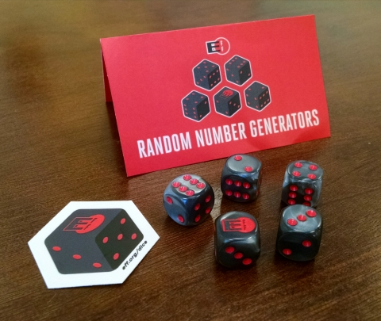
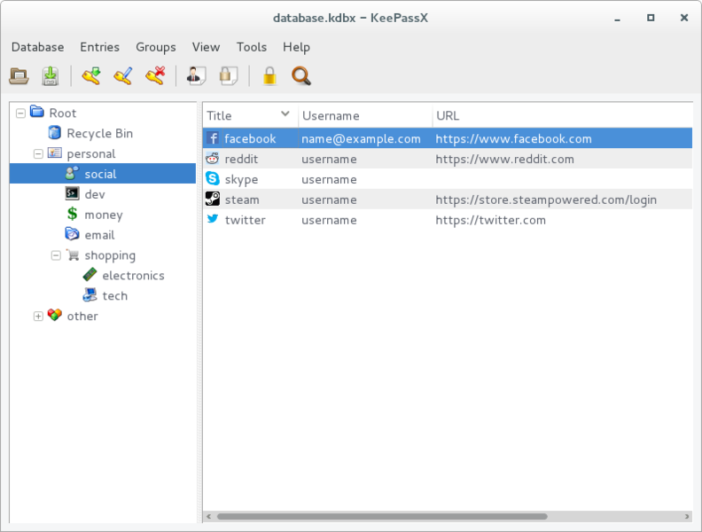
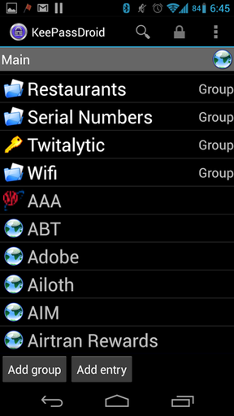
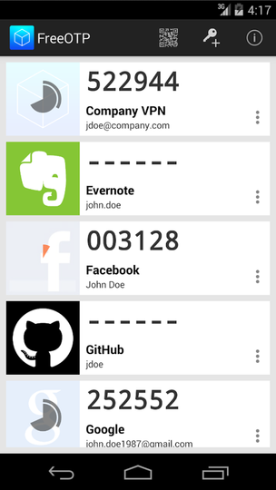

<!-- $theme: default -->
<!-- page_number: true -->
<!-- $size: A4 -->
<!-- footer: CryptoParty: Oficina senhas seguras -->

## O elo mais fraco da nossa segurança: S&nh5s

### Entenda o que são, como criar e gerenciar senhas fortes

* caioau ([@caioauv](https://twitter.com/caioauv)) - CryptoParty - 26 agosto 2017

    + [caioau.keybase.pub](https://caioau.keybase.pub/) → [caioauheyuuiavlc.onion](http://caioauheyuuiavlc.onion/)

---

# Resumo: 

* Analise de 10 milhões de senhas.
* Não repita a mesma senha em dois lugares.
* Sua senha não pode conter datas, nomes ou qualquer coisa pessoal.
* Use senhas verdadeiramente aleatórias: dadoware (diceware).
* Use um Gerenciador de senhas (Password Manager).
* Habilite autenticação em duas etapas (2FA).
* Troque suas senhas com frequência (tipo de 3 em 3 meses).
* Dicas para manter computador e celular seguros.
* **QUEM TEM COOKIE TEM MEDO**

---

# Glossario

## Engenharia Social:
Def: Engenharia social é a manipulação psicológica de pessoas para que realizem ações ou revelem informações.

---

Exemplo: Kevin Mitnick sempre pregou que a estupidez humana é a maior falha de qualquer sistema.

---

Cartão do Mitnick

---

Enganando a operadora.

Repare que o Mitnick "hackeou" a operadora sem nem usar um computador, só persuadindo as pessoas.

---

## (Logaritmo) Definição:

Chama-se logaritmo de b na base a, o expoente que se deve dar à base a de modo que a potencia obtida seja igual a b.

Em símbolos: se a,b ∈ ℝ, 0 < a ≠ 1 e b > 0 , então:

$\log_a  b = x \Leftrightarrow a^x = b$

---

# Propriedades dos logaritmos:

## Logaritmo da potencia:

$\log_a b^c = c \cdot \log_a b$

## Mudança de base:

$\log_a b = \dfrac{\log_c b}{\log_c a}$

---

## Escalas Logarítmicas: 

Quantidades que variam abruptamente:

* Pincode 4 dígitos = $10^4 =$ 10 mil combinações
* Senha 9 caracteres = $94^9 =$ 572994802228616704 (572 quadrilhão) 

Ou seja é difícil representar o numero de combinações. 

---

---

Senha de comprimento L e utilizando N símbolos  → $N^L$ combinações. 

$H = \log_2(N^L) = L \cdot \log_2(N)$ 

cresce linearmente com conforme o tamanho da senha aumenta :)

Exemplos de escala logarítmicas: 
* Richter (terremotos).
* Decibel (som).
* Oitavas (musica).
* pH (química).

---

# Motivação:

Vazamento LinkedIn Jun2016: 61 milhões de senhas → 2h para quebrar 65% delas :O

---

Verifique por vazamentos: [haveibeenpwned.com](https://haveibeenpwned.com)

---

# Análise de senhas:

Analise de um conjunto de dados com 10 milhões de senhas [link](https://xato.net/today-i-am-releasing-ten-million-passwords-b6278bbe7495#.6eti1aoge) 

Minha análise propõe estudar as seguintes características de interesse:

* As senhas mais comuns.
* Os tamanhos das senhas.
* Os grupos de caracteres (tipo: a senha tem apenas minúsculas e números).
* As “máscaras” das senhas.
    + (Estou chamando de máscara o “padrão” daquela senha, exemplo: a senha “abc123” tem a máscara “lllddd”, onde _l_ representa as minúsculas, _d_ os números, _u_ as maiúsculas e _s_ os caracteres especiais.)

---

### Resultados :

São 5,1 milhões (5.189.333) de senhas únicas, no total 9.997.922 senhas. 

Abaixo estão as 10 senhas mais frequentes,  correspondendo a 1.41%:

Senha       |    %freq
:---------- | -------------
123456      |     0.56%
password    |     0.20%
12345678    |     0.14%
qwerty      |     0.13%
123456789   |     0.12%
12345       |     0.11%
1234        |     0.06%
111111      |     0.06%
1234567     |     0.05%
dragon      |     0.04%

---

Abaixo os grupos:

Grupos   |  %
:------  | -------
l        | 38.25%
l+d      | 29.86%
d        | 20.36%
u+l+d    | 5.71%
u+l      | 2.52%
u+d      | 1.10%
u        | 1.09%
l+s      | 0.40%

---

Abaixo os 11 tamanhos mais frequentes:

tam      |  %
:--------|:---------
8        |  29.81%
6        |  25.45%
7        |  16.63%
9        |  6.81%
5        |  4.95%
10       |  4.71%
4        |  3.45%
11       |  2.64%
12       |  1.91%
13       |  1.36%
14       |  0.77%

---

Abaixo as 20 máscaras mais frequentes, correspondem a 65% do total:

máscara     |  %
----------  |  -------
llllll      |  11.76%
llllllll    |  8.98%
lllllll     |  7.50%
dddddddd    |  7.40%
dddddd      |  7.03%
lllll       |  3.15%
ddddddd     |  2.09%
lllllldd    |  2.00%
lllllllll   |  1.97%

---

# Lei de Zipf:

A lei diz a _k_-ésima palavra mais frequente vai aparecer proporcional a  _1/k_.

---

A lei de Zipf é um caso discreto da distribuição de Pareto, onde sua densidade vale:
$P(x) = \frac{ab^a}{x^{a+1}}$

onde o suporte é _x ≥ b_ e _a > 1_;

Perceba que se aplicarmos log na distribuição teremos:
$\log(P(x)) = \log\left(\frac{ab^a}{x^{a+1}}\right) = \log(a) + a \log(b) -(a+1)\log(x)$

ou seja, o gráfico log-log da distribuição de Pareto é uma reta decrescente.

---

Dito isso, esse padrão não acontece apenas nas línguas, mas também descreve:

* População de cidades.
* O trafico de web-sites.
* A magnitude de terremotos.
* O número de citações em artigos acadêmicos.
* O diâmetro das crateras da lua.
* E [muito mais](http://arxiv.org/pdf/cond-mat/0412004.pdf).

---

# Princípio de Pareto:

Como tantos processos da vida real se comportam segundo a distribuição de Pareto, a partir da distribuição surge o Princípio de Pareto, que diz que via de regra aproximadamente 20% das causas são responsáveis por 80% dos resultados. 

Por exemplo:

* Na língua inglesa, 18% das palavras mais frequentes correspondem a 80% das ocorrências.
* Os 20% mais ricos correspondem a 82,7% de toda riqueza mundial.
* Nos EUA, 20% dos pacientes usam 80% dos recursos de saúde.

Depois, o Zipf percebeu que esse padrão 80/20 era uma consequência do princípio do menor esforço. Os falantes de uma língua naturalmente preferem usar menos palavras possível para se expressar, resultando em menos trabalho.

---

# Voltando para as senhas:

Lembrando que o gráfico log-log da distribuição de Pareto é uma reta descreste, assim temos os gráficos:

---

---

---

---

O Princípio de Pareto (aproximadamente 20% das causas são responsáveis por 80% dos resultados) também ocorre em:

* 20% dos grupos correspondem a 88% das senhas.
* 14% dos tamanhos correspondem a 88% das senhas

---

# Feynman: o abridor de cofres

---

Enquanto trabalhava no projeto Manhattan, ele queria mostrar que a guarda de documentos secretos era insegura.

Cofre: 100 marcações → segredo são 3 números → 1 milhão comb.

5s por tentativa → 60 dias para tentar todas as combinações

Faynman demorava 1.5 minuto :O

---

## Como ele conseguiu esse feito?

* Tolerância mecânica de ± 2 , assim ele não precisava tentar as 100 combinações, mas apenas 20 ( 2 , 7 ,12 , 17 ... , 87, 92 , 97 ). Então agora tem apenas 8 mil demorando 10 horas.

* Muitas pessoas usavam uma data (DDMMAA) ou seja 30 , 12 e 45 combinações e considerando a tolerância mecânica isso dá 162 combinações ou seja 18 minutos.

* Muitos usavam como senha as constantes pi e _e_ ou seja 3.14159... → 31-41-59 , 2.71828... → 27-18-28.

---

* Muitos não mudaram a senha padrão: 25-0-25 ou 50-25-50.

* Enquanto conversa com seus colegas e seu cofre estava aberto, girando o disco ele ouvia 2 clicks, descobrindo os 2 últimos números , assim ele tinha que testar 20 combinações, demorando 1.5 minutos.

---

Em suma, Feynman tinha a reputação de abridor de cofres, pois:

* teve um pouco de "mente aberta" e perceber a tolerância mecânica.
* entender a natureza humana na escolha dos segredos.
* usava de eng. social para descobrir (grande parte) dos segredos.

---

# Entropia de Shannon:

Intuitivamente pensamos que senha boa é uma senha toda complicada e difícil de lembrar.

por exemplo: **S&nh5F0d@** 

Ela tem: 
* 9 caracteres.
* maiúsculas.
* minúsculas. 
* números. 
* caracteres especiais. 

então ela deve ser boa. Porém, conforme veremos logo mais, **essa senha é quebrada em segundos.**

---

## Uma definição de aleatoridade

Um evento é chamado aleatório de Kolmogorov se o menor programa de computador que produz aquele evento é maior ou igual que a descrição do evento em si.

---
Pense em um número entre 1 e 20. 

Pesquisa com n=347

Você pensou em 17, 7 ou 13? Normalmente primos são favorecidos.

---

Outro exemplo é a falácia do apostador: um apostador deve apostar se uma bolinha vai cair no preto ou vermelho. 

Depois dela ter caído, por exemplo, 4 vezes seguidas no vermelho, o apostador pensa que é mais “provável” que agora ela “deve” cair na preta.

Porém, a bolinha tem 50%-50% de cair no preto e vermelho, **INDEPENDENTEMENTE DO RESULTADOS ANTERIORES**.

---

Para fechar: Compare o lançamento de uma moeda 30 vezes com como você acha que ela vai cair.

A distinção aparecera ao contar sequencias de lançamentos, uma moeda verdadeiramente aleatória vai ser igualmente provável de conter qualquer sequencia de qualquer comprimento. (estabilidade de frequência). 

---

Mais exemplos:
* Problema de Monty Hall.
* Paradoxo do aniversario.

Ou seja: as pessoas têm uma intuição deturpada de um resultado aleatório. Esse comportamento de manada acaba produzindo senhas mais previsíveis.

---

Então, como avaliar se uma senha é de fato boa? Precisamos introduzir um conceito da teoria da informação, que é o conceito de entropia de Shannon: a entropia é a “media” de informação que aquela senha contém.

A entropia _H_, medida em bits, de uma senha com comprimento _L_, utilizando _N_ símbolos é definida como log na base 2 de todas as combinações que a senha pode ter, ou seja:

$H= \log_2(N^L) = L \cdot \log_2(N)$

---

Agora que sabemos como calcular a entropia, podemos calcular a tabela abaixo:

Grupo    |  Num símbolos (N)  |   entropia/simbolo (H)
:--------|:------------------:|:-----------------------:
números  |         10         |           3.32
letras   |         26         |           4.7
base64   |         64         |           6
“tudo”¹  |         94         |           6.5
palavra² |         7776       |           12.92

¹: tudo = maiúsculas (26) + minúsculas (26) + números (10) + caracteres especiais (32) = 94 símbolos.

---

Ou seja, de acordo com a tabela, uma senha **verdadeiramente aleatória** com 8 caracteres usando “tudo” tem _6,5 \* 8 = 52_ bits de entropia.

Dito isso, não existe uma maneira melhor de começar a falar de senhas boas do que a tirinha do xkcd:

---

creditos : [xkcd](https://www.xkcd.com/936/), tradução: [Oficina AntiVigilancia](https://antivigilancia.org/pt/2015/06/abre-te-sesamo-as-senhas-da-nossa-vida-digital-2/) 

---

Agora fica a pergunta: quanta entropia minha senha deve ter?

No documentário [Citizenfour](http://www.imdb.com/title/tt4044364/) o Snowden fala:

> Assume your adversary is capable of one trillion guesses per second.

Assim, vamos presumir 1 trilhão de tentativas por segundos (que é um valor bastante razoável).

O tempo para quebrar uma senha (_T_) é o número de combinações que aquela senha pode ter, dividido pelo número de tentativas por segundo (_P_).

ou seja: _T = 2^(entropia) / P_.

Portanto, vamos calcular a tabela abaixo (considerando _P = 1_ trilhão/s) e o tamanho necessário da senha:

---

Entropia  |  Tempo para quebrar  |   base64  |   “tudo” |   N. de palavras
----------|:--------------------:|:---------:|:--------:|:----------------:
40        |  1.1 segundo         |   7       |   7      |   3
50        |  19 minutos          |   9       |   8      |   4
60        |  13 dias             |   10      |   10     |   5
65        |  1.1 anos            |   11      |   10     |   6
70        |  37 anos             |   12      |   11     |   6
80        |  38 milênios         |   14      |   13     |   6
100       |  40 bilhões de anos  |   17      |   16     |   8

(Observação importante: esse tempo é o tempo **GARANTIDO** de quebrar a senha. Ou seja, é o tempo que demora para percorrer TODAS as possibilidades. O tempo real para quebrar a senha pode ser menor)

---

Quero saber se minha senha é boa: você pode olhar a primeira tabela e calcular manualmente a entropia dela, mas sugiro que use [esse medidor de senha chamado Rumkin](http://rumkin.com/tools/password/passchk.php) ou [a lib `zxcvbn`](https://github.com/dropbox/zxcvbn) que [você pode usar aqui](https://dl.dropboxusercontent.com/u/209/zxcvbn/test/index.html).

(Observação: esses dois medidores de senhas avaliam sua senha localmente no seu navegador, nunca enviando a senha para a internet. Você pode digitar sua senha neles sem medo.)

Voltando pro exemplo do começo: a senha **S&nh5F0d@** é baseada em 2 palavras comuns e somente feita algumas substituições comuns e etc…

Segundo o Rumkin, **ela tem 40,7 bits de entropia**, que segundo a nossa tabela **é quebrada em questão de segundos** (o `zxcvbn` também mostrou isso).

---

# Método Diceware :

Preciso criar uma senha que seja fácil de lembrar e que tenha bastante entropia. Aí entra o método diceware (em português dadoware)

Diceware é um método no qual, através de um dado, uma lista de palavras, papel e lápis podemos construir senhas mais seguras.

Consulte o [livreto](https://github.com/thoughtworks/dadoware) da ThoughtWorks para pegar a lista de palavras.

O método consiste em usar o dado para sortear palavras da lista. Jogue o dado 5 vezes por palavra. Os dois primeiros números são as paginas do livreto e os três últimos, a palavra.

---

Por exemplo: você tirou no dado: 2-6-5-1-3 : vá na pagina 2,6 do livreto e procure a palavra 513 = egípcio.

[EFF Passphrase Dice](https://supporters.eff.org/shop/eff-passphrase-dice)

---

## Quantas palavras usar? 

Como para cada palavra jogamos o dado 5 vezes, a lista de palavras tem _6^5 = 7776_ palavras e conforme calculamos isso resulta em 12,92 bits de entropia por palavra sorteada, então **é indicado usar 6 palavras**

---

# Aprimorando o Diceware:

Para gerar senhas ainda mais seguras, usando o diceware, podemos:

* Colocar alguns caracteres especiais e números entre as palavras (no livreto tem uma tabela, para sorteá-los usando o dado).
* Colocar aleatoriamente algumas letras em maiúscula.
* Pessoalmente, gosto de, ao invés de sortear 6 palavras, sortear 5 e, para a última, uso uma palavra que não existe na lista, nem em dicionários, etc… usando por exemplo um termo técnico, ou nome de uma marca etc…

---

Exemplo de senha gerada:

> evocar encher acerto 833?LANCHE# azul >Caloria<

Ela tem 47 caracteres e segundo o Rumkin ela tem 240 bits de entropia, ou seja uma senha bastante forte e fácil de lembrar \\o/

(tirar?): Porém o Rumkin calcula a entropia dela usando a tabela, ou seja considerando que é uma completamente aleatória , ele não sabe que usamos o método diceware, fazendo uma conta honesta teremos: 
* 6 palavras (6*12.92).
* 4 caracteres especiais (4*5).
* 3 numeros (3*3.32).
* 2 maiusculas (2*1).
assim teremos: 109 bits de entropia.

---

Em suma, o diceware é um método de gerar senhas que é:

* Harder: as senhas geradas são verdadeiramente aleatórias as tornando bem mais difíceis de quebrar.
* Better: são melhores para lembrar.
* Faster: é mais rápido de pensar numa senha, basta jogar o dado (ou fazer no computador).
* Stronger: As senhas geradas são fortes, pois tem mais entropia.

---

# Gerenciador de senhas (Password Manager)

Agora que sabemos como avaliar se uma senha é boa e como gerar boas senhas, ainda precisamos resolver o seguinte problema: precisamos ter uma senha para cada serviço.

Uma solução para isso é um password manager (gerenciador de senhas), é um programa que cria boas senhas aleatórias automaticamente, para cada site individualmente, guardando todas essas senhas trancadas com apenas uma senha mestra.

**KeePass/KeePassX** é minha recomendação padrão, ele é software livre, está disponível nas principais distros GNU/Linux e existe pra Android: [o KeePassDroid](https://f-droid.org/repository/browse/?fdfilter=keepass&fdid=com.android.keepass) (na F-Droid) e tem auto-type.

---

---

---

O uso dele é: você cria seu banco de senhas (.kdb ou .kdbx), cadastra as entradas de seus serviços e, então, o programa gera uma senha aleatória, como por exemplo: 

> Z:wQ~zKvu.QGF;)x2Gj_4>b>1Ra71k

Quando você precisar acessar uma senha, você abre o arquivo, ele vai pedir sua senha mestra e então selecione a entrada que você precisa.

---

## Como acessar as entradas:

* Area de transferencia: Pressionando control-C com a entrada desejada selecionada e control-V no campo de senha.
* Auto-Type: configure o atalho e ele vai digitar login e senha sozinho.

---

# Dica: Key stretching (reloginho)

A fim de melhorar ainda mais a segurança do KeePass, vá em configurações do database e clique no reloginho que aparece, Com isso, quando você abrir o KeePassX, ele vai demorar um pouco mais (tipo 1s no total), mas fica mais difícil de quebrar sua senha mestra pois cada tentativa demorará 1s (em computadores tão rápidos quanto o seu).

---

## Como sincronizar minhas senhas com meu celular?

Recomendo o software livre [Syncthing](https://syncthing.net/) é um app pra android e um programa pra pc, no qual ele sincroniza pastas entre seus dispositivos, criando assim sua nuvem pessoal e descentralizada. 

---

# Habilite autenticação em duas etapas (2FA)

A ideia por trás da autenticação em duas etapas (2FA -- 2 factor authentication) é que para entrar na sua conta além da senha (que uma coisa que só você sabe), precisa de uma coisa que só você tem, no caso um app no celular.

Como usar: cada serviço é diferente, veja aqui [turnon2fa.com](https://www.turnon2fa.com/) como habilitar no serviço especifico. Normalmente, você escaneia um QR code com um app. Recomendo o [freetop](https://f-droid.org/repository/browse/?fdfilter=freeotp&fdid=org.fedorahosted.freeotp) (é software livre, tem na F-Droid e pra iOS).

Quando você for entrar na sua conta, após colocar a senha, deverá colocar um número gerado pelo app. Cada número só dura 30s, então não tem problema se alguém ver o código num determinado momento, conforme mostrado abaixo:

---

---

Caso você não esteja convencido que precisa disso: veja essa reportagem que foi capa da _Wired_ em Dez2012: [Kill the Password: A String of Characters Won't Protect You](https://www.wired.com/2012/11/ff-mat-honan-password-hacker/).

---

Resumidamente: por meio de engenharia social, descobriram algumas informações pessoais dele, ligaram no suporte da Apple, falando que ele tinha esquecido a senha dele e com as informações dele conseguiram responder as perguntas de segurança. Assim, pegaram a senha do iCloud dele, entraram no Find My mac e mandaram deletar remotamente os dispositivos dele.

Ou seja, muito embora o Mat Honan usasse senhas robustas, conseguiram “pegar tudo” dele.

---

# Autenticação em duas etapas com SMS:

Alguns serviços, como o Twitter, oferecem autenticação em duas etapas usando um SMS, ao invés de um app. Isso é um problema, pois SMSes e ligações telefônicas podem ser facilmente interceptadas por meio de IMSI Catchers, que são torres de celular falsas que fazem um ataque do tipo homem-no-meio.

Veja um artigo da oficina anti-vigilância explicando como detectar e se prevenir contra esses ataques: [Detectando antenas de celular espiãs](https://antivigilancia.org/pt/2016/03/detectando-antenas-de-celular-espias/).

Além disso, mesmo quando o celular está bloqueado, a notificação mostra a mensagem na tela de bloqueio, por exemplo:

---

---

Você pode resolver isso: 

* Android: vá em Configurações → Notificações,  selecione o app de SMS e configure para não exibir notificações sensíveis. 
* Iphone: vá em Ajustes → Notificações → selecione o app de SMS → Mostrar Pré-visualizações e configure.

---

---

# PinCodes: 

[PIN analysis](http://www.datagenetics.com/blog/september32012/)

---

Em excelente seu post ([PIN analysis](http://www.datagenetics.com/blog/september32012/)), Nick Berry analisou 3.4 milhões de PinCodes de 4 dígitos (10 mil combinações). E constatou:

* Os top 20 pincodes são responsaveis por 27% do total.
* Estatisticamente 1/3 de todos os PinCodes podem ser adivinhados apenas testando 61 combinações.
    + 50% pode ser adivinhado testando apenas 426 combinações (muito menos que 5000).
* PinCodes contendo Anos (19XX) e datas (MMDD) são muito frequentes.

---

# Padrão de desbloqueio do Android

Se você usa o padrão do Android (aquela gradezinha 3x3): existem 389112 possibilidades que podem ser usadas (ou seja **usar um PinCode verdadeiramente aleatorio de 6 digitos é um pouco melhor** ).

Uma pesquisadora norueguesa chamada Marte Løge em sua tese de mestrado mostrou que mais de 10% dos padrões analisados, usa como padrão de desbloqueio uma "letra" que é a inicial do companheiro, filho, ou algo parecido.

veja o artigo na arstechnica falando sobre o assunto: [New data uncovers the surprising predictability of Android lock patterns](https://arstechnica.com/security/2015/08/new-data-uncovers-the-surprising-predictability-of-android-lock-patterns/)

---

## Recomendação: 

Use uma senha forte pra criptografia de disco e um PinCode de (pelo menos) 6 dígitos pra desbloquear o celular. Tem um App chamado SnooperStopper ([FDroid](https://f-droid.org/repository/browse/?fdfilter=snoop&fdid=cz.eutopia.snooperstopper)) ele depois de 3 tentativas erradas na tela de desbloqueio o celular reinicia , pedindo a senha forte. 

---
# Boas Praticas de Segurança: Computador

* mantenha seu sistema e programas atualizados.
* não use flash.
* faça backups.
* baixe apenas programas confiáveis de fontes confiáveis.
* proteja seu wifi:
    + use uma senha forte.
    + troque a senha padrão da gerencia e desabilite o acesso remoto.
    + desabilite o UPnP e o WPS.
    + mantenha o firmware do seu roteador atualizado (e se possível procure alternativas livres como librewrt)

---

# Dicas especificas pro Windows:

* crie apenas um usuário administrador e use apenas os usuários sem privilégios de administrador.
* use um antivírus e o mantenha atualizado. 
* use uma conta local (não utilize sua conta microsoft).
* use e rode com frequência o CCleaner ou Advanced SystemCare.
* desinstale programas desnecessários. 

Windows 10: Desativar envio de seus dados: [Destroy Windows 10 Spying](https://github.com/Nummer/Destroy-Windows-10-Spying)

---
# Boas Praticas de Segurança: Android:
* [The Privacy Enthusiast's Guide to Using Android](http://lifehacker.com/the-privacy-enthusiasts-guide-to-using-android-1792432725): 
    + Use PinCode ou senha Forte (6+ digitos **VERDADEIRAMENTE ALEATÓRIOS**).
    + Não utilize sua digital para desbloquear seu aparelho, pois podem forçar você a colocar seu dedo no seu celular.
    + "Esconda" notificações sensíveis da tela de bloqueio.
    + Desative "minhas atividades" do Google (histórico de buscas, localização, etc ...): [myactivity.google.com/myactivity](https://myactivity.google.com/myactivity)
    + Desative Backup do Google: histórico de chamadas, senhas do Wifi e Apps são salvos no Google.
    + Desative permissões desnecessárias.
    + Vá no app de Camera e desabilite a opção de Geolocalização.
    + Use o app chamado Send Reduced que além de tirar metadados de fotos, reduz seu tamanho, [fdroid](https://f-droid.org/repository/browse/?fdfilter=size&fdid=mobi.omegacentauri.SendReduced)

---

